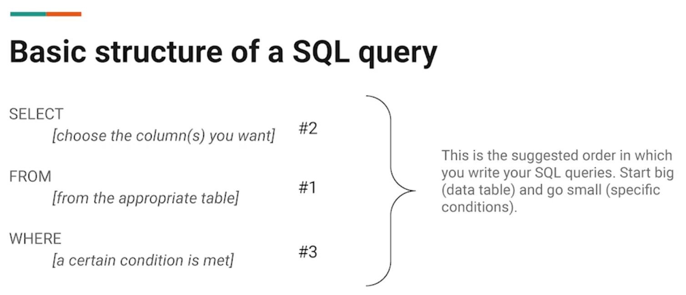

# Empezar con SQL y la visualización de datos

## SQL en acción
- ​Como recordará, anteriormente ​hablamos del Lenguaje de consulta SQL.
- ​En este vídeo, verá SQL en ​acción y aprenderá lo que puede hacer con él, ​con algunos ejemplos de consultas específicas.
- ​Supongo que puede llamarse a esto la secuela de SQL.
- ​Intentaremos que ésta sea incluso mejor que la original.
- ​Recuerde, SQL puede hacer con los datos muchas ​de las mismas cosas que pueden hacer las hojas de cálculo.
- ​Puede utilizarlo para almacenar, ​organizar y analizar sus datos, entre otras cosas.
- ​Pero como toda buena secuela, ​es a mayor escala, más grande, más llena de acción.

- ​Piense en ella como en hojas de cálculo supergrandes.
- ​Por ejemplo, podría considerar ​una hoja de cálculo cuando tenga un conjunto de datos más pequeño, ​como uno con sólo 100 filas.
- ​Pero si su conjunto de datos parece no tener fin, ​y su hoja de cálculo tiene dificultades para seguirle el ritmo, ​SQL sería el camino a seguir.
- ​Cuando utilice SQL, necesitará ​un lugar donde se entienda el lenguaje SQL.
- ​Si alguna vez ha ido a algún sitio y no conoce el idioma, ​puede ser un reto comunicarse.
- ​Puede pensar que está pidiendo ​una cosa y obtener algo completamente diferente.
- ​Bueno, SQL conoce esa sensación.

- ​SQL necesita una base de datos que entienda su lenguaje.
- ​Hablemos.
- Hay una serie ​de bases de datos por ahí que utilizan SQL.
- ​Es posible que utilice varias de ellas ​durante su tiempo como Analista de datos.
- ​Pero aquí está la cosa, ​no importa qué base de datos utilice, ​SQL funciona básicamente para lo mismo en cada una.
- ​Por ejemplo, en SQL, las `query` son universales.
- ​Hemos hablado de `query` antes, ​pero nunca está de más tener un repaso.

- ​Una consulta es una solicitud de ​datos o información de una base de datos.
- ​Aquí tiene la estructura de una consulta básica.
- ​Puede ver que con esta consulta podemos ​seleccionar datos específicos de ​una tabla añadiendo donde podemos ​filtrar los datos basándonos en determinadas condiciones.



- ​Comencemos.
- Abriremos nuestra base de datos y veremos cómo ​SQL puede comunicarse con ella para realizar alguna tarea de datos sencilla.
- ​Primero, vamos a seleccionar nuestro conjunto de datos.
- (La Base de datos mostrada es BigQuery, que se trata en el Curso 3 de este certificado.)
- ​Usaremos un asterisco para ​seleccionar todos los datos de la tabla.

- ​Con esa sencilla consulta, ​la base de datos llama a la tabla que necesitamos.
```SQL
SELECT *
FROM movie_data.movies;
```
- ​Magic.
- Vamos a añadir Where ​a nuestra consulta para mostrar cómo eso cambia los datos que obtenemos.
```SQL
SELECT *
FROM movie_data.movies
WHERE Genre__1_ = 'Action';
```
- ​Puede ver que los datos ahora sólo muestran, ​películas que pertenecen al género de acción.
- ​Eso es todo, una consulta básica en SQL.
- ​Magnífico, ¿verdad? Pronto ​aprenderá a crear `query` más complejas.

- ​Por ahora, sin embargo, podemos celebrar ​el aprendizaje de la estructura de una consulta SQL básica, ​select, from y where.
- ​A medida que continúe con el Programa, ​tendrá la oportunidad de utilizar SQL usted mismo.
- ​Espero que este vídeo haya sido ​un útil anticipo de lo que vendrá más adelante.