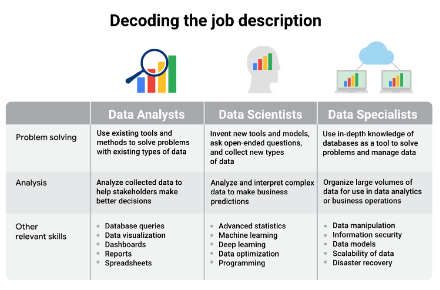

# Opcional: Explore su próximo trabajo

## Analistas de datos en diferentes industrias
- A estas alturas, ya sabemos que hay todo tipo de ​empleos en diferentes sectores disponibles para los analistas de datos.
- ​Pero ahora es el momento de pensar ​en algo igual de importante, ​¿cómo puede saber si un empleo se adapta bien a ​usted y a sus objetivos profesionales? Difícil.
- ​No se preocupe, eso es exactamente lo que ​trataremos en este vídeo.
- ​Hay muchos factores importantes en los que ​pensar a la hora de buscar el trabajo de sus sueños.
- ​Hablemos primero de algunos de los factores más comunes, ​industria, herramientas, ubicación, viajes y cultura.
- ​Los datos ya están siendo utilizados por ​inumerables industrias en todo tipo de formas diferentes, ​tecnología, marketing, finanzas, sanidad, ​la lista continúa.

- ​Pero una cosa que es importante tener en cuenta, ​cada industria tiene necesidades específicas de datos ​que tienen que ser abordadas ​de manera diferente por sus analistas de datos.
- ​Los mismos datos de Ingresos pueden ser utilizados de ​tres maneras diferentes por ​analistas de datos en tres industrias diferentes, ​servicios financieros, Telecomunicaciones y tecnología.
- ​Por ejemplo, un analista financiero de ​un banco utiliza los datos públicos de ingresos de ​la empresa de telecomunicaciones X para crear una Proyección que ​predice dónde estarán los ingresos en ​el futuro para recomendar el precio de las acciones.
- ​El analista comercial de la empresa de telecomunicaciones X ​utiliza esos mismos datos para asesorar al Equipo de ventas.
- ​Entonces, un analista de datos de la empresa ​que creó una herramienta de gestión de clientes para ​la empresa de telecomunicaciones X utilizará esos ​datos de ingresos para determinar la ​eficacia del software.
- ​Las finanzas, las telecomunicaciones y la tecnología, ​utilizan los datos de forma diferente, ​por lo que necesitan analistas que tengan distintas habilidades.
- ​Todo se reduce a cuáles son las necesidades del sector.

- ​Estas necesidades determinarán la tarea que se le asignará, ​las preguntas que responderá e ​incluso cómo enfocará la búsqueda de empleo.
- ​Si acaba de empezar, ​una buena forma de orientar su búsqueda es ​pensar primero en lo que le interesa.
- ​¿Ayudar a las personas a estar ​más sanas le parece significativo? ​Quizá quiera centrarse en el uso de ​datos para mejorar los ingresos hospitalarios.
- ​¿Qué le parecería ayudar a la gente a ahorrar para un feliz retiro? ​Quizá le interese un trabajo en el que se utilicen Datos para ​determinar los factores de Riesgo en las inversiones financieras.
- ​O quizá le interese ayudar a ​crecer el periodismo en su ciudad.

- ​Un trabajo en el que se utilicen Datos para ayudar a ​su sitio web de noticias local a encontrar ​más suscriptores podría ser la función perfecta para usted.
- ​La clave está en pensar en ​sus intereses al principio de su búsqueda de empleo.
- ​Eso le llevará en la dirección correcta, ​y también le ayudará en las entrevistas.
- ​Los posibles empleadores querrán saber ​por qué le interesa su empresa, ​y cómo puede satisfacer sus necesidades, ​así que si puede hablar de ​su motivación para trabajar en ​el análisis de datos durante las entrevistas, ​se destacará de una forma estupenda.
- ​Tendrá opciones en cuanto a ​dónde y para quién trabaja.
- ​Pero recuerde que quiere disfrutar con lo que hace, ​así que es una buena idea pensar ​en cómo quiere utilizar sus habilidades.
- ​Luego busque trabajos que le permitan hacer eso.

- ​Lo siguiente en la lista de cosas en las que pensar ​es la ubicación y los viajes.
- ​Cuando empiece a buscar trabajo, ​tendrá que tomar algunas decisiones ​sobre dónde quiere vivir, ​así que le ayudará plantearse algunas preguntas, ​¿Su sector preferido tiene ​oportunidades en su zona?
- ¿Intenta quedarse en la zona ​o le gustaría trasladarse? ​¿Cuánto tiempo está dispuesto a desplazarse al trabajo cada día? ​¿Va a ir en coche al trabajo, ​a pie, en transporte público?
- ¿Es posible durante todo el año? ​¿Qué le parece trabajar a distancia? ​¿Trabajar desde casa le entusiasma o le aburre?
- ​Por supuesto, tendrá que tener en cuenta el coste de la vida, ​y si desea o no ​la comodidad de vivir en la ciudad o en una tranquila casa de las afueras, ​y no se trata sólo de dónde estará destinado, ​algunos trabajos pueden pedirle que viaje, ​lo que podría ser una oportunidad emocionante de ver ​el mundo o un motivo de ruptura.
- ​Todo depende de lo que usted quiera de este trabajo, ​así que empiece a hacerse algunas de estas preguntas.
- ​Descubrir las respuestas puede ayudarle a ​limitar aún más su búsqueda, ​de modo que sólo busque trabajos que realmente aceptaría.
- ​Una vez que haya respondido a suficientes preguntas, ​podrá identificar ​algunas empresas concretas que se ajustan a sus necesidades.
- ​En este punto, es un buen momento para pensar en ​sus valores y en qué ​cultura de empresa encaja mejor con usted.
- ​Listo, aquí vienen algunas preguntas más, ​¿Trabaja mejor en equipo o solo?
- ​¿Le gusta tener una rutina establecida o ​disfruta asumiendo un nuevo proyecto y probando cosas nuevas? ​¿Sus valores coinciden con los valores de la empresa?
- ​Deberá prestar atención a estas cosas durante ​su proceso de búsqueda de empleo y entrevista, ​así podrá estar seguro de que ​invierte plenamente en la empresa para la que trabaja.
- ​Ésa es la mejor manera de empezar a construir ​una carrera apasionante y satisfactoria.
- ​Este Programa le ayudará a aprender ​los conocimientos básicos para el análisis de datos en cualquier entorno, ​usted decide adónde quiere llevarlos, ​ya sea que eso signifique empezar en una industria completamente nueva, ​o pasar a un puesto de analista en ​una industria en la que ya tiene experiencia.
- ​Es de esperar que lo que hemos tratado aquí le haya ayudado ​a encarrilar su futura búsqueda de empleo.
- ​Después de esto, tiene unas cuantas actividades que hacer, ​y entonces podrá pasar a ​la siguiente parte de este curso.

- ​Hemos aprendido mucho hasta ahora, ​como qué oportunidades hay ahí fuera ​para los analistas de datos en diferentes industrias.
- ​Cómo ayudan los analistas de datos a las empresas a tomar mejores decisiones.
- ​La importancia de la Equidad y la Analítica de datos, ​y las posibles preguntas que puede empezar a ​preguntarse antes de su futura búsqueda de empleo, ​y siempre puede volver a ​estas lecciones si quiere repasar.
- ​En un próximo curso, ​veremos las habilidades que tienen todos los analistas de datos de éxito ​y aprenderá cómo ​usted también puede empezar a practicarlas.
- ​Pero antes de eso, tendrá una evaluación.
- ​Buena suerte y hasta luego.

---

## Funciones y descripción de puestos de analista de datos
- ASÍ COMO LA TECNOLOGÍA SIGUE AVANZANDO, ser capaz de recopilar y analizar los datos de esa nueva tecnología se ha convertido en una enorme ventaja competitiva para muchas empresas.
- Todo, desde los sitios web hasta las redes sociales, está repleto de datos fascinantes que, si se analizan y utilizan correctamente, pueden ayudar a tomar decisiones empresariales.
- La capacidad de una empresa para prosperar ahora depende a menudo de lo bien que sepa aprovechar los datos, aplicar la analítica e implementar las nuevas tecnologías.

- Esta es la razón por la que los analistas de datos cualificados son algunos de los profesionales más buscados del mundo.
- Un estudio realizado por IBM estima que hay más de 380.000 vacantes en el campo del Análisis de datos en Estados Unidos (datos de Burning Glass, 1 de febrero de 2021 - 31 de enero de 2022, EE.UU).
- Como la Demanda es tan fuerte, podrá encontrar oportunidades de trabajo en prácticamente cualquier sector.
- Haga una búsqueda rápida en cualquier sitio de empleo importante y se dará cuenta de que todo tipo de empresas, desde zoológicos a clínicas de salud, pasando por bancos, buscan profesionales con talento en el campo de los Datos.
- Incluso si el título del trabajo no utiliza el término exacto "analista de datos", la descripción del trabajo para la mayoría de las funciones que implican el análisis de datos probablemente incluirá muchas de las habilidades y cualificaciones que obtendrá al final de este Programa.
- En esta lectura, exploraremos algunas de las funciones relacionadas con el análisis de datos que podría encontrar en diferentes empresas e industrias.

- Descifrando la descripción del puesto
   - La función de analista de datos es uno de los muchos puestos de trabajo que contienen la palabra "analista".
   - Por nombrar algunos otros que suenan parecido pero que pueden no ser la misma función
      - Analista de negocios-analiza datos para ayudar a las empresas a mejorar procesos, productos o servicios
      - Consultor en Analítica de datos-analiza los sistemas y modelos de uso de los datos
      - Ingeniero de datos: prepara e integra datos de distintas fuentes para su uso analítico
      - Científico de datos-utiliza habilidades expertas en tecnología y ciencias sociales para encontrar tendencias a través del análisis de datos
      - Especialista en datos-organiza o convierte los datos para su uso en bases de datos o sistemas de software
      - Analista de datos de operaciones: analiza los datos para evaluar el rendimiento de las operaciones y los flujos de trabajo de la empresa
- Analistas de datos, científicos de datos y especialistas en datos suenan muy parecido pero se centran en tareas diferentes.
- Cuando empiece a examinar las ofertas de empleo en línea, es posible que se dé cuenta de que las descripciones de los puestos de las empresas parecen combinar estas funciones o buscar candidatos que puedan tener aptitudes que se solapan.
- El hecho de que las empresas difuminen a menudo las líneas que las separan significa que debe tener especial cuidado al leer las descripciones de los puestos y las competencias requeridas.
- La tabla siguiente ilustra algunos de los solapamientos y distinciones entre ellos:

- Hemos utilizado la función de especialista en datos como ejemplo de las muchas especializaciones dentro de la analítica de datos, ¡pero no tiene por qué convertirse en un especialista en datos!
- Las especializaciones pueden tomar diversos giros.
- Por ejemplo, podría especializarse en el desarrollo de visualizaciones de datos y, del mismo modo, profundizar mucho en esa área.

- Especializaciones laborales por industria
   - Hemos aprendido que la función de especialista en datos se concentra en el conocimiento profundo de las bases de datos.
   - De forma similar, otros papeles de especialista para analistas de datos pueden centrarse en el conocimiento en profundidad de industrias específicas.
   - Por ejemplo, en un trabajo como analista de negocios podría llevar algunos sombreros diferentes que en un puesto más general como Analista de datos.
   - Como analista de negocios, probablemente colaboraría con los directivos, compartiría sus hallazgos sobre los datos y quizá explicaría cómo un pequeño cambio en el sistema de gestión de proyectos de la empresa podría ahorrar a la compañía un 3% cada trimestre.
   - Aunque seguiría trabajando con datos todo el tiempo, se centraría en utilizar los datos para mejorar las operaciones empresariales, la eficiencia o el balance final.
   - Otros puestos de especialista en sectores específicos que podría encontrar en su búsqueda de empleo de Analista de datos son:
      - Analista de marketing-analiza las condiciones del mercado para evaluar las ventas potenciales de productos y servicios.
      - Analista de RRHH/nóminas-analiza los datos de las nóminas en busca de ineficiencias y errores
      - Analista financiero: analiza la situación financiera recopilando, supervisando y revisando los datos
      - Analista de riesgos: analiza los documentos financieros, las condiciones económicas y los datos de los clientes para ayudar a las empresas a determinar el nivel de riesgo que implica la toma de una decisión empresarial concreta
      - Analista sanitario-analiza datos médicos para mejorar el aspecto empresarial de hospitales e instalaciones médicas

- Puntos clave
   - Explore las descripciones de los puestos de analista de datos y las funciones de analista específicas de cada sector.
   - Empezará a hacerse una idea más clara de los distintos puestos de analista de datos que existen y de qué tipo de funciones le interesa más desempeñar. 

---

## Samah Buenas prácticas en las entrevistas
- ​Mi nombre es Samah Moid y soy reclutadora ​en Google para el gran equipo de ventas al cliente.
- ​Básicamente, aquí contrato talento para el equipo de ventas.
- ​Incluso en el ámbito de la contratación de ventas, ​recluto específicamente para ​los puestos de liderazgo analítico aquí en Google.
- ​Quiero que el candidato esté lo más cómodo posible.
- ​Como reclutador, también soy su defensor.
- ​Si son una buena opción para el equipo, ​me gustaría presentarlos de la mejor manera.
- ​Como reclutador, daría algunos consejos a ​un analista de datos que esté empezando a buscar trabajo.

- ​Piense en un momento en el que ​utilizó datos para resolver un problema, ​ya sea en sus proyectos profesionales o personales.
- ​Otro consejo, diría que ​para un analista de datos que ​busca un nuevo trabajo es aumentar su red profesional.
- ​Hay muchas maneras de aumentar ​su red profesional.
- ​Una de ellas es aumentar su presencia en línea, ​ponerse en contacto con otros analistas en LinkedIn y ​unirse a reuniones locales con otros científicos de datos.
- ​A veces, cuando buscamos un conjunto de habilidades único, ​los reclutadores van a sitios web como LinkedIn ​y GitHub e intentan encontrar ese talento por sí mismos.
- ​Es muy importante tener tu LinkedIn ​actualizado junto con sitios web como GitHub, ​donde puedes mostrar muchos de ​los proyectos de analistas de datos que has realizado.
- ​Otro consejo que diría para ​una entrevista en persona es ​preparar las preguntas para el entrevistador.

- ​Asegúrese de que no sean preguntas generales.
- ​Deben ser preguntas que te ayuden a entender ​mejor al equipo y al trabajo.
- ​Si te dan un caso de éxito en una entrevista, ​debes esperar que te presenten ​un problema empresarial junto con el conjunto de datos de muestra.
- ​Luego se le pedirá que tome ese conjunto de datos de muestra ​, lo analice y encuentre una solución.
- ​Una de las cosas que puede hacer para prepararse para ​esto es ​asegurarse de analizar los datos ​y encontrar una solución ​que se relacione con esos datos.
- ​A veces no hay ​una respuesta correcta y muchas veces los entrevistadores buscan ver ​tu proceso de pensamiento y la forma en ​que llegas a tu solución.
- ​Te recomiendo encarecidamente que, si ​encuentras un puesto que te interese, ​no solo lo solicites, sino que des el siguiente paso.

- ​Busca al reclutador.
- Busque ​al gerente de contratación en línea.
- ​Comprueba si puedes comunicarte con ellos y programar ​una charla de café o enviarles tu currículum directamente.
- ​Las solicitudes en línea pueden ser ​un gran agujero negro en el ​que nunca recibas respuesta del reclutador o del equipo.
- ​Cuando te pones en contacto directamente con ​un gerente de contratación o un reclutador, ​realmente demuestra tu entusiasmo ​por el puesto y tus intereses por el puesto.
- ​Incluso si a veces no ​recibes una respuesta al contactar con alguien, ​nunca se sabe, lo intentas varias veces diferentes.
- ​Esa única vez que recibas una respuesta ​de un reclutador o gerente de contratación, ​podría ser el momento en que consigas el trabajo que realmente querías.

---

## Más allá de los números: El viaje de un analista de datos
- En lugar de una lectura, le invitamos a ver
   - la charla TEDx de Anna Leach en [YouTube](https://www.youtube.com/watch?v=t2oOFs4WgI0&feature=emb_title) o en la plataforma [TED](https://www.ted.com/talks/anna_leach_building_authentic_relationships) para conocer otro interesante viaje como analista de datos.

