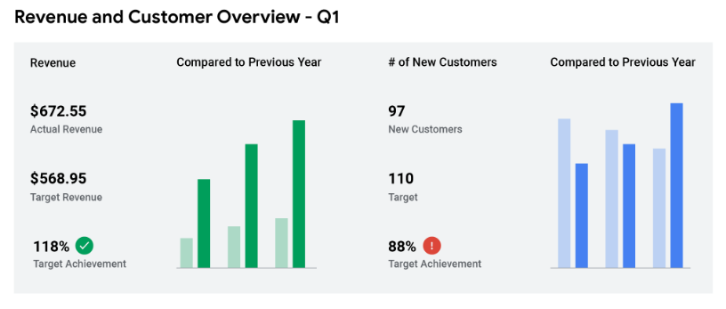
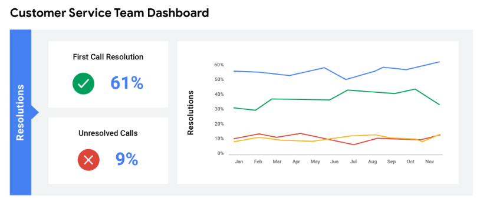
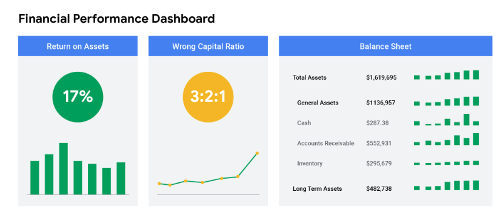

# Seguir las pruebas

## La gran revelación: Comparta sus hallazgos
- Datos excelentes, pero si ​no podemos comunicar la historia que cuentan los datos, ​no son útiles para nadie.
- ​Necesitamos formas de organizar los datos que ​nos ayuden a convertirlos en información.
- ​Existen todo tipo de herramientas para ayudarlo a ​visualizar y compartir ​su análisis de datos con la parte interesada.
- ​A continuación, hablaremos de ​dos herramientas de presentación de datos, informes y paneles.
- ​Tanto los informes como los paneles son ​útiles para la visualización de datos.
- ​Pero hay ventajas y desventajas para cada uno de ellos.
- ​Un informe es una recopilación estática de ​datos que se entrega periódicamente a la parte interesada.

- ​Un panel de control, por otro lado, ​monitorea los datos entrantes en vivo.
- ​Hablemos primero de los informes.
- ​Los informes son excelentes para ofrecer instantáneas de ​datos históricos de alto nivel para una organización.
- ​Por ejemplo, las ventas mensuales de una empresa financiera.
- ​Los informes también tienen muchos beneficios.
- ​Se pueden diseñar y enviar periódicamente, ​a menudo de forma semanal o mensual, ​como información organizada y fácil de consultar.
- ​Se diseñan rápidamente y son fáciles de ​usar siempre que los mantengas continuamente.

- ​Por último, dado que los informes utilizan ​datos estáticos o datos que no cambian una vez registrados, ​reflejan datos que ya se han limpiado y ordenado.
- ​También hay algunas desventajas a tener en cuenta.
- ​Los informes necesitan un mantenimiento regular ​y no son muy atractivos desde el punto de vista visual.
- ​Como no son automáticos ni dinámicos, ​los informes no muestran datos en vivo y en evolución.
- ​Para reflejar en tiempo real los datos entrantes, ​querrá diseñar un tablero.
- ​Los paneles son excelentes por muchas razones: ​dan a tu equipo más acceso ​a la información que se registra, ​puedes interactuar a través de los datos jugando con los filtros ​y, dado que son dinámicos, ​tienen un valor a largo plazo.
- ​Si la parte interesada necesita acceder continuamente a la información, ​un panel de control puede ser más eficiente que ​tener que consultar los informes una y otra vez, ​lo que supone un gran ahorro de tiempo para usted.

- ​Por último, pero no menos importante, ​son agradables a la vista.
- ​Sin embargo, los dashboards también tienen algunas desventajas.
- ​Por un lado, su diseño lleva mucho tiempo y, de ​hecho, pueden ser menos eficientes que los informes ​si no se utilizan con mucha frecuencia.
- ​Si la mesa base se rompe en algún momento, ​necesitan mucho mantenimiento para ​volver a funcionar.
- ​Los paneles de control a veces también pueden abrumar a ​las personas con información.
- ​Si no está acostumbrado a ​revisar los datos de un tablero, ​es posible que se pierda en él.
- ​Como analista de datos, ​debe decidir la mejor manera de ​comunicar la información a su parte interesada.

- ​Por ejemplo, ¿qué pasa si su parte interesada está ​interesada en la participación de la empresa en las redes sociales? ​¿Sería ​útil un informe mensual que les diga el número de nuevos seguidores de su página? ​¿O un panel que monitorea la ​participación en las redes sociales en vivo en múltiples plataformas? ​Más adelante, creará ​sus propios informes y ​paneles para practicar el uso de estas herramientas.
- ​Pero por ahora, quiero mostrarles ​cómo podrían ser un informe y un panel de control.
- ​Empezaremos por usar una herramienta con la que ​ya estamos familiarizados, las hojas de cálculo.
- ​Veamos una forma de ​visualizar los datos de una hoja de cálculo en un informe.

- ​Esta hoja de cálculo tiene un conjunto de datos con ​detalles de pedidos de una empresa mayorista.
- ​Es mucha información.
- ​En los encabezados, podemos ver ​diferentes cosas registradas aquí, ​como la fecha del pedido, ​el vendedor, el precio unitario ​y los ingresos de cada transacción registrada.
- ​Todo es información útil, ​pero un poco difícil de entender.
- ​Queremos un informe que sea más fácil de leer.
- ​Supongamos que su parte interesada quiere ​ver rápidamente los ingresos por vendedor.
- ​Con los datos, puede convertirlos en una ​tabla dinámica con un gráfico que muestre esa información.

- ​Una tabla dinámica es ​una herramienta de resumen de datos ​que se utiliza en el procesamiento de datos.
- ​Las tablas dinámicas se utilizan para resumir, ordenar, reorganizar, ​agrupar, contar, sumar ​o promediar los datos almacenados en una base de datos.
- ​Permite a sus usuarios ​transformar columnas en filas y filas en columnas.
- ​De hecho, aprenderemos más sobre las tablas dinámicas más adelante.
- ​Pero te enseñaré uno muy rápido.
- (La opción de menú ha cambiado ligeramente. Para insertar una tabla dinámica seleccione Insertar y Tabla dinámica.)
- ​Seleccionaremos el menú Datos y haremos clic en el botón Tabla dinámica.
- ​Puede extraer datos de esta tabla.

- ​Simplemente podemos presionar ​crear y se abrirá una nueva hoja de trabajo.
- ​Aquí, nos da los ​campos de la tabla dinámica entre los que podemos elegir.
- ​Haga clic en seleccionar, vendedor e ingresos.
- ​Así de simple, hizo un gráfico para nosotros.
- ​En este punto, puedes ​jugar con el aspecto del gráfico, ​pero toda la información está ahí.
- ​Pasemos a los paneles.
- ​Si necesitas una forma más dinámica de ​compartir información con tu parte interesada, los ​paneles son tus amigos.

- ​Puede crear algo como este dashboard de Tableau.
- ​Con gráficos interactivos que ​muestran múltiples vistas de los datos.
- ​Con esto, los usuarios pueden cambiar la ubicación, el intervalo de fechas ​o cualquier otro aspecto de los datos que están viendo ​haciendo clic en diferentes elementos del tablero.
- ​Bastante guay, ¿verdad? ​Más adelante en este programa, ​veremos cómo puede crear ​sus propias visualizaciones de datos.
- ​Tenemos mucho que aprender antes de llegar a eso.
- ​Pero espero que este haya sido un primer vistazo emocionante a ​las diferentes herramientas de visualización ​que utilizará como analista de datos.

---

## Datos frente a Métricas
- ​En el último vídeo, aprendimos cómo puede visualizar sus datos utilizando informes y ​cuadros de mando para mostrar sus hallazgos de formas interesantes.
- ​En uno de nuestros ejemplos, ​la empresa quería ver los ingresos por ventas de cada vendedor.
- ​Esa medición específica de datos se realiza utilizando métricas.
- ​Ahora, quiero hablarle un poco más sobre la diferencia entre Datos y ​métricas.
- ​Y cómo pueden utilizarse las métricas para convertir los datos en información útil.
- ​Una métrica es un tipo de dato único y cuantificable que puede utilizarse para realizar mediciones.
- ​Piénselo de esta manera.

- ​Los datos comienzan como una colección de hechos en bruto, hasta que los organizamos ​en métricas individuales que representan un único tipo de datos.
- ​Las métricas también pueden combinarse en fórmulas en las que puede introducir ​sus datos numéricos.
- ​En nuestro anterior ejemplo de ingresos por ventas, todos esos datos no significan gran cosa ​a menos que utilicemos una métrica específica para organizarlos.
- ​Así que utilicemos los ingresos por vendedor individual como nuestra métrica.
- ​Ahora podemos ver qué ventas aportaron los mayores ingresos.
- ​Las métricas suelen implicar matemáticas sencillas.
- ​Los ingresos, por ejemplo, son el número de ventas multiplicado por el precio de venta.

- ​Elegir la métrica correcta es clave.
- ​Los datos contienen muchos detalles en bruto sobre el problema que estamos explorando.
- ​Pero necesitamos las métricas correctas para obtener las respuestas que buscamos.
- ​Los distintos sectores utilizan todo tipo de métricas para medir las cosas en un conjunto de datos.
- ​Veamos otras formas en que las empresas de distintos sectores utilizan las métricas.
- ​Para que pueda ver cómo aplicar las métricas a los datos recopilados.
- ​¿Ha oído hablar alguna vez del ROI? 

- ​Las empresas utilizan esta métrica todo el tiempo.
- ​El ROI, o Retorno de la inversión, es esencialmente una fórmula diseñada utilizando ​métricas que permiten a una empresa saber lo bien que está funcionando una inversión.
- ​El ROI se compone de dos métricas, ​el beneficio neto durante un periodo de tiempo y el coste de la inversión.
- ​Al comparar estas dos métricas, el beneficio y el coste de la inversión, la empresa ​puede analizar los datos de los que dispone para ver lo bien que le está yendo su inversión.
- ​Esto puede ayudarles a decidir cómo invertir en el futuro y ​a qué inversiones dar prioridad.
- ​Vemos que las métricas también se utilizan en marketing.
- ​Por ejemplo, las métricas pueden utilizarse para ayudar a calcular las tasas de retención de clientes, ​o la capacidad de una empresa para mantener a sus clientes a lo largo del tiempo.

- ​Las tasas de retención de clientes pueden ayudar a la empresa a comparar el número de clientes al ​principio y al final de un periodo para ver sus tasas de retención.
- ​De este modo, la empresa sabe el éxito de sus estrategias de marketing ​y si necesita investigar nuevos enfoques para volver a atraer a más clientes ​Las distintas industrias utilizan todo tipo de métricas diferentes.
- ​Pero hay una cosa que todas tienen en común: ​todas intentan alcanzar un objetivo específico midiendo datos.
- ​Este objetivo métrico es un objetivo medible establecido por una empresa y evaluado utilizando métricas.
- ​Y al igual que hay muchas métricas posibles, ​también hay muchos objetivos posibles.
- ​Puede que una organización quiera alcanzar un determinado número de ventas mensuales, ​o tal vez un determinado porcentaje de clientes que repiten.
- ​Al utilizar métricas para centrarse en aspectos individuales de sus datos, ​puede empezar a ver la historia que cuentan sus datos.
- ​Los objetivos métricos y las fórmulas son excelentes formas de medir y comprender los datos.
- ​Pero no son las únicas formas.
- ​A lo largo de este curso hablaremos más sobre cómo interpretar y comprender los datos.

---

## Herramientas para la visualización de datos
- En este curso, trabajará con Tableau y con hojas de cálculo.
- Ambas herramientas tienen ventajas y desventajas
- A menudo, los analistas de datos descubrirán que necesitan utilizar varias herramientas, incluso en un solo proyecto.
- Lo que utilice vendrá determinado en gran medida por el trabajo que esté realizando y sus objetivos.
- Esta lectura explora dos de las herramientas que podría utilizar para visualizar y presentar datos: las hojas de cálculo y Tableau. 

- Hojas de cálculo
   - Tanto Google Workspace como Microsoft Office Suite ofrecen aplicaciones de hojas de cálculo.
   - Ya ha trabajado con Google Sheets en este curso, y su funcionamiento es muy similar al de Microsoft Excel.
   - Si desea comparar algunas de las características de Sheets con las de Excel, eche un vistazo al vídeo de [Microsoft Crear un gráfico de principio a fin.](https://support.microsoft.com/en-us/office/create-a-chart-from-start-to-finish-0baf399e-dd61-4e18-8a73-b3fd5d5680c2)
   - Tanto Sheets como Excel son opciones a las que recurrir para crear diagramas y gráficos estáticos.
   - Ofrecen capacidades básicas de Visualización de datos que a menudo son suficientes para visualizaciones sencillas.
   - Además, puede utilizarlas para limpiar, ordenar y filtrar datos.
   - Y ambos ofrecen una serie de tipos de gráficos, herramientas gráficas y tablas dinámicas para crear visualizaciones de datos eficaces.
   - Estos gráficos son fáciles de gestionar; se actualizan cuando se actualizan los datos de origen, por lo que no requieren mucha intervención manual una vez implementados. 
   - Sheets y Excel están conectadas a otras aplicaciones de sus suites de productos.
   - Google Docs y Diapositivas son muy similares a Microsoft Word y Powerpoint, por ejemplo.
   - Puede incorporar visualizaciones de datos de Sheets o Excel en informes y documentos de Docs y Word.
   - Programas de presentación como Diapositivas y Powerpoint le permiten crear presentaciones atractivas que incluyen visualizaciones de datos para que pueda compartir estadísticas en un formato de presentación.
   - Obtenga más información sobre el poder de esta interconectividad entre las herramientas de Google en el artículo [Vincular un Gráfico, una Tabla o Diapositivas a Google Docs o Diapositivas](https://support.google.com/docs/answer/7009814?hl=en&co=GENIE.Platform%3DDesktop). 

- Tableau
   - Tableau se utiliza para crear visualizaciones potentes e interactivas, lo que lo convierte en una excelente opción para las visualizaciones de datos, como los cuadros de mando en directo.
   - Tableau también facilita la creación de cuadros, gráficos y paneles de control en una interfaz de arrastrar y soltar.
   - La aplicación es compatible con una amplia gama de fuentes de datos y proporciona capacidades de análisis avanzadas.
   - Estas características permiten explorar en profundidad las tendencias y los patrones de los Datos. 
   - Tableau resulta especialmente útil para crear visualizaciones a partir de enormes conjuntos de datos, como en este [Informe sobre la felicidad en el mundo](https://www.kaggle.com/datasets/unsdsn/world-happiness) de Sustainable Development Solutions, que utiliza datos de informes globales sobre las calificaciones de felicidad de distintos países.
   - Del mismo modo, esta visualización de [Datos estatales sobre Población y Vivienda](https://www.census.gov/library/visualizations/interactive/2020-population-and-housing-state-data.html) a partir de Datos del Censo de Estados Unidos de 2020 compara las tasas de población en Estados Unidos y las viviendas disponibles. 
   - Tableau es ampliamente conocido y utilizado por su versatilidad y potencia, pero puede llevar bastante tiempo aprender a utilizar Tableau con eficacia.
   - Pronto empezará a practicar con Tableau.
   - Pero si quiere comprobarlo ahora, existe un entorno gratuito al que puede acceder en [Tableau Public](https://www.tableau.com/products/public).

- Puntos clave
   - Existen muchas herramientas de visualización que tendrá la oportunidad de utilizar como profesional de los datos.
   - Las distintas herramientas tienen diferentes ventajas y desventajas.
   - Aunque, en última instancia, Tableau tiene más potencia que una aplicación básica de hoja de cálculo, se suele utilizar para casos concretos y para trabajar con grandes conjuntos de datos.
   - No subestime lo mucho que puede hacer con las hojas de cálculo ni lo potente que puede ser la interconectividad entre aplicaciones
   - La mayoría de las veces, sobre todo para algo como un informe rápido, es más probable que busque en su caja de herramientas la aplicación de hoja de cálculo que prefiera.
   - Pero su carrera en el campo de los Datos se beneficiará definitivamente de Tableau, así que a medida que progrese aproveche las oportunidades de trabajar con él.
   - Con tantas situaciones diferentes de análisis de datos, familiarizarse con todas estas herramientas le ayudará a saber cuál es la mejor para cada situación. 

---

## Diseñe cuadros de mando atractivos
- Los paneles son potentes herramientas visuales que le ayudan a contar la historia de sus datos.
- Un cuadro de mando es una herramienta que monitoriza los datos entrantes en directo.
- Organiza la información de múltiples conjuntos de datos en una ubicación central, lo que ofrece un enorme ahorro de tiempo.
- Los analistas de datos utilizan los cuadros de mando para controlar, analizar y visualizar los datos con el fin de responder a preguntas y resolver problemas.
- Para hacerse una idea básica del aspecto de los cuadros de mando, consulte este artículo: ["Ejemplos reales de cuadros de mando de Inteligencia empresarial"](https://www.tableau.com/learn/articles/business-intelligence-dashboards-examples)

- La belleza de los cuadros de mando
   - La siguiente tabla resume los beneficios de utilizar un cuadro de mando tanto para los analistas de datos como para las partes interesadas.

| Beneficios | Para los analistas de datos | Para las partes interesadas |
| ---------- | --------------------------- | --------------------------- |
| Centralización | Comparta una única fuente de Datos con todas las partes interesadas  | Trabaje con una visión completa de los datos, iniciativas, objetivos, proyectos, procesos, etc |
| Visualización de datos | Muestre y actualice en tiempo real los datos entrantes*  | Detecte tendencias y patrones de cambio con mayor rapidez |
| Perspicacia | Extraiga información relevante de distintos conjuntos de datos | Comprenda la historia que hay detrás de los números para no perder de vista los objetivos y tomar decisiones basadas en datos |
| Personalización | Cree vistas personalizadas dedicadas a una persona, un proyecto o una presentación de los datos concretos | Profundice en áreas más específicas de interés o preocupación especializada |

- Es importante recordar que los datos modificados se incorporan automáticamente a los cuadros de mando sólo si la estructura de los datos es la misma.
- Si la estructura de los datos cambia, tendrá que actualizar el diseño del cuadro de mando antes de que los datos puedan actualizarse en directo.

- Tableau 
   - Existen muchas herramientas de visualización diferentes.
   - Una de las más potentes es Tableau, que admite diversas fuentes de datos y dispone de funciones de análisis avanzadas que permiten explorar en profundidad las tendencias y pautas de los datos.
   - Tableau puede manejar más datos y conjuntos de datos más grandes que muchas otras herramientas y ofrece disponibilidad de datos en tiempo real. 
   - Lleva algún tiempo aprender a utilizar Tableau, pero sus esfuerzos pueden verse recompensados, ya que las visualizaciones de Tableau son agradablemente interactivas.
   - Para que un cuadro de mando tenga éxito, debe atraer a los usuarios y ayudarles a aprender.
   - Tableau se ha esforzado mucho para garantizar que sus usuarios tengan una gran experiencia y que la plataforma sea accesible para todos. 

- Crear un panel de control
   - He aquí un proceso que puede seguir para crear un cuadro de mando, ya sea en Tableau o en otra herramienta de visualización:
   1. Identifique a las partes interesadas que necesitan ver los Datos y cómo los van a utilizar
      - Comience formulando preguntas eficaces.
      - Consulte esta [hoja de trabajo de recopilación de requisitos de cuadros](https://s3.amazonaws.com/looker-elearning-resources/Requirements+Gathering+Worksheet.pdf) de mando para explorar una amplia gama de buenas preguntas que puede utilizar para identificar a las partes interesadas y sus necesidades de datos.
      - Este es un gran recurso que le ayudará a guiarse a través de este proceso una y otra vez.
   2. Diseñe el panel (qué debe mostrarse)
      - Utilice estos consejos para que el diseño de su panel sea claro y fácil de seguir:
         - Utilice un Encabezado claro para etiquetar la Información.
         - Añada breves descripciones de texto a cada visualización.
         - Muestre la información más importante en la parte superior.
   3. Cree maquetas si lo desea
      - Una maqueta es un boceto sencillo de una visualización que se utiliza para planificar un cuadro de mando y evaluar su progreso.
      - Esto es opcional, pero a muchos Analistas de datos les gusta esbozar sus cuadros de mando antes de crearlos. 
   4. Seleccionar las visualizaciones
      - Aquí tiene muchas opciones.
      - Las visualizaciones que seleccione dependerán de la Historia de datos que esté contando.
      - Si necesita mostrar un cambio de valores a lo largo del tiempo, los gráficos de líneas o de barras pueden ser la mejor opción.
      - Si su objetivo es mostrar cómo contribuye cada parte a la cantidad total de la que se informa, un gráfico de tarta o de donuts es probablemente una mejor elección.
   - Para saber más sobre cómo elegir las visualizaciones adecuadas, consulte las galerías de Tableau:
      - Para ver más ejemplos de gráficos de área, gráficos de columnas y otras visualizaciones, visite la [Galería de cuadros de mando de Tableau](https://www.tableau.com/solutions/gallery). Esta galería está repleta de magníficos ejemplos creados con datos reales; explore este recurso por su cuenta para inspirarse.
      - Explore el [Viz del día de Tableau](https://public.tableau.com/en-us/gallery/?tab=viz-of-the-day&type=viz-of-the-day) para echar un vistazo a las visualizaciones comisariadas por la comunidad. Se trata de visualizaciones creadas por usuarios de Tableau y son una forma estupenda de conocer cómo utilizan otros analistas de datos las herramientas de visualización de datos. 
   5. Cree filtros según sus necesidades
      - Los filtros muestran determinados datos mientras ocultan el resto de los datos en un cuadro de mando.
      - Esto puede ser de gran ayuda para identificar patrones manteniendo intactos los datos originales.
      - Es habitual que los analistas de datos utilicen y compartan el mismo cuadro de mando, pero gestionen su parte del mismo con un filtro.
      - Para profundizar en los filtros y encontrar un ejemplo de filtros en acción, visite la página de Tableau sobre [Acciones de filtrado](https://help.tableau.com/current/pro/desktop/en-us/actions_filter.htm).
      - Se trata de un recurso útil que podrá guardar y al que podrá volver cuando empiece a practicar el uso de filtros en Tableau por su cuenta.

- Puntos clave
   - Al igual que el cuadro de mandos de un avión muestra al piloto su ruta de acceso, su cuadro de mandos hace lo mismo para sus partes interesadas.
   - Les ayuda a navegar por la ruta de acceso de un proyecto dentro de los datos.
   - Si añade marcadores claros y resalta los puntos importantes de su cuadro de mando, los usuarios comprenderán hacia dónde se dirige su historia de datos.
   - Entonces, podrán trabajar juntos para asegurarse de que el negocio llega a donde tiene que llegar. 

---

## Autorreflexión: Profundice en los cuadros de mando
- Resumen de actividades
   - Anteriormente, se le presentó la herramienta de gestión de datos conocida como cuadro de mando.
   - En esta autorreflexión, examinará diferentes tipos de cuadros de mando y considerará cómo los utilizan los analistas de datos y sus empleadores.
   - A modo de repaso, un cuadro de mando es un punto de acceso único para gestionar la información de una empresa.
   - Permite a los analistas extraer información clave de los datos en una revisión rápida mediante la visualización de los datos de una forma que facilita la comprensión de las conclusiones.
   - Esta autorreflexión le ayudará a desarrollar la percepción de su propio aprendizaje y le preparará para conectar su conocimiento de los cuadros de mando con lo que sabe sobre las necesidades empresariales.
   - A medida que responda a las preguntas -y formule las suyas propias- tendrá en cuenta conceptos, prácticas y principios que le ayudarán a refinar su comprensión y a reforzar su aprendizaje.
   - Usted ha hecho el trabajo duro, así que asegúrese de sacarle el máximo partido: ¡Esta reflexión le ayudará a que sus conocimientos se queden grabados!

- Tipos de paneles de control
   - Para refrescar la memoria, considere los diferentes tipos de cuadros de mando que puede utilizar una empresa.
   - A menudo, las empresas adaptan un cuadro de mando a un propósito específico. Las tres categorías más comunes son:
      - Estratégico: se centra en objetivos y estrategias a largo plazo en el nivel más alto de métricas
      - Operativo : seguimiento del rendimiento a corto plazo y objetivos intermedios
      - Analítico : consiste en los conjuntos de datos y las matemáticas utilizadas en estos conjuntos

- Paneles de control estratégicos
   - Un amplio abanico de empresas utilizan cuadros de mando estratégicos a la hora de evaluar y alinear sus objetivos estratégicos.
   - Estos cuadros de mando proporcionan información sobre el marco temporal más amplio, desde un único trimestre financiero hasta años.
   - Suelen contener información útil para la toma de decisiones en toda la empresa.
   - A continuación se muestra un ejemplo de cuadro de mando estratégico que se centra en los indicadores clave de rendimiento (KPI) a lo largo de un año.

- Cuadros de mando operativos
   - Los cuadros de mando operativos son, posiblemente, el tipo más común de cuadro de mando.
   - Dado que estos cuadros de mando contienen información en una escala temporal de días, semanas o meses, pueden proporcionar información sobre el rendimiento casi en tiempo real.
   - Esto permite a las empresas seguir y mantener sus procesos operativos inmediatos a la luz de sus objetivos estratégicos.
   - El cuadro de mando operativo que se muestra a continuación se centra en el servicio al cliente.
   

- Cuadros de mando analíticos
   - Los cuadros de mando analíticos contienen una gran cantidad de datos utilizados por los analistas de datos.
   - Estos cuadros de mando contienen los detalles implicados en el uso, el análisis y las predicciones realizadas por los científicos de datos.
   - Sin duda la categoría más técnica, los cuadros de mando analíticos suelen ser creados y mantenidos por los equipos de científicos de datos y rara vez se comparten con la alta dirección, ya que pueden ser muy difíciles de entender.
   - El panel de control analítico que se muestra a continuación se centra en las métricas de los resultados financieros de una empresa.

1. Reflexión
   - Considere los diferentes tipos de cuadros de mando:
   - ¿En qué se parecen entre sí los distintos tipos de cuadros de mando?
   - ¿En qué se diferencian?
   - Escriba 2-3 frases (40-60 palabras) en respuesta a cada una de estas preguntas.
> Los 3 cuados de mando se parecen en que muestran una métrica acumulada como valor actual, promedio, mayor o menos, esto acompañado de un gráfico con datos adicionales. La diferencia entre los es el tipo y la forma de presentar los datos, en algunos son tipos de datos de dinero, otros porcentajes, otros valores fijos, unos cuadros de mandos muestran más detalles de valores previos mientras que otros solo dan a entender cómo cambia en el tiempo.

- Comentarios
   - ¡Buen trabajo reforzando su aprendizaje con una autorreflexión reflexiva! Algunos puntos en común de estos ejemplos son:
      - Los paneles son visualizaciones: La visualización de datos puede ser enormemente útil para comprender y demostrar lo que realmente significan los datos.
      - Los paneles identifican Métricas: Las Métricas relevantes pueden ayudar a los analistas a evaluar el rendimiento de la empresa.
   - Algunas diferencias incluyen el marco temporal descrito en cada cuadro de mando. El cuadro de mando operativo tiene un marco temporal de días y semanas, mientras que el cuadro de mando estratégico muestra todo el año. El cuadro de mando analítico se salta un marco temporal específico. En su lugar, identifica y realiza un seguimiento de los distintos KPI que pueden utilizarse para evaluar los objetivos estratégicos y operativos.

2. Ahora que ha considerado los diferentes tipos de cuadros de mando, piense en el impacto que los cuadros de mando pueden tener en una empresa:
   - ¿Cuál es un ejemplo de fuente de datos que una empresa podría utilizar con un cuadro de mando?
   - ¿Cómo se beneficiaría una empresa de un cuadro de mando que utilizara estos Datos?
   - ¿Qué sectores o negocios podrían beneficiarse más que otros del uso de cuadros de mando?
   - Ahora, escriba 2-3 frases (40-60 palabras) en respuesta a cada una de estas preguntas. Introduzca su respuesta en el cuadro de texto que aparece a continuación.
> Los cuadros de mando son utiles para ver como avanza el negocio, un ejemplo puede ser las ventas del día, el promedio diario de venta e incluso comparar eso con el mes o el año pasado. Una empresa que utiliza cuadros de mandos le permite tomar decisiones basada en datos, puede saber que productos se venden más y cuanto stock les queda, de esta forma poder tomar acción y conseguir más stock. Creo que todos los sectores o negocios se podrían beneficiar de cuadros de mando, sin embargo, lo importante del cuadro de mando es que métrico y datos se está monitoreando.

- Comentarios
   - ¡Gracias por su respuesta! Los paneles de control pueden ayudar a las empresas a realizar muchas tareas útiles, como:
      - Seguimiento del rendimiento histórico y actual.
      - Establecer objetivos a largo y/o corto plazo.
      - Definir indicadores clave de rendimiento o Métricas.
      - Identificar problemas potenciales o puntos de ineficacia.
   - Aunque casi todas las empresas pueden beneficiarse de alguna manera del uso de un cuadro de mando, las empresas más grandes y las que tienen una gama más amplia de productos o servicios probablemente se beneficiarán más. Las empresas que operan en mercados volátiles o que cambian rápidamente, como las de marketing, ventas y tecnología, también tienden a obtener estadísticas más rápidamente y a tomar decisiones basadas en datos.