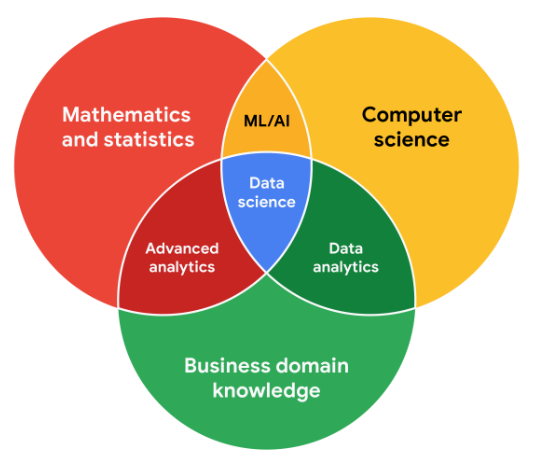

# Equilibrio entre las necesidades del Equipo y las de las partes Interesadas

## Comunicación con su Equipo
- Hola, bienvenido.
- ​Hasta ahora ha aprendido cosas como Hojas de cálculo, ​habilidades de Pensamiento analítico, Métricas y Matemáticas.
- ​Todas ellas son Habilidades técnicas súper importantes ​que desarrollará a lo largo de ​su carrera en Análisis de datos.
- ​También debe tener en cuenta que ​hay algunas habilidades no técnicas que ​puede utilizar para crear ​un entorno de trabajo positivo y productivo.
- ​Estas habilidades le ayudarán a considerar la forma en que ​interactúa con sus compañeros ​, así como con sus partes interesadas.
- ​Ya sabemos que es importante tener en cuenta ​las necesidades de los miembros de su equipo y de las partes interesadas.
- ​A continuación, hablaremos de por qué es así.

- ​Empezaremos aprendiendo algunas ​mejores prácticas de comunicación que puede utilizar en su trabajo diario.
- ​Recuerde, la comunicación es clave.
- ​Empezaremos aprendiendo ​todo sobre la comunicación efectiva, ​y cómo equilibrar las necesidades de los miembros del equipo y de los Interesados.
- ​Piense en estas habilidades como nuevas herramientas ​que le ayudarán a trabajar con su equipo para ​encontrar las mejores soluciones posibles.
- ​Muy bien, pasemos al siguiente vídeo y empecemos.

---

## Equilibre las necesidades y expectativas de todo su Equipo
- ​Como analista de datos, ​tendrá que centrarse en muchas cosas diferentes, ​y las expectativas de las partes interesadas son ​una de las más importantes.
- ​Vamos a hablar sobre por qué ​las expectativas de las partes interesadas son tan importantes para ​su trabajo y veremos ​algunos ejemplos de las necesidades de las partes interesadas en un proyecto.
- ​A estas alturas ya me has escuchado usar mucho el término parte interesada.
- ​Así que vamos a refrescarnos sobre lo que es una parte interesada.
- ​Las partes interesadas son personas que ​han invertido tiempo, interés ​y recursos en los proyectos ​en los que trabajarás como analista de datos.
- ​En otras palabras, tienen algo en juego en lo que estás haciendo.
- ​Es muy probable que necesiten ​el trabajo que tú haces para satisfacer sus propias necesidades.

- ​Por eso es tan importante ​asegurarte de que tu trabajo se ajusta a sus necesidades ​y por eso necesitas comunicarte de ​manera efectiva con toda ​la parte interesada de tu equipo.
- ​Su parte interesada querrá ​hablar sobre temas como el objetivo del proyecto, ​lo que necesita para alcanzar ese objetivo ​y cualquier desafío o inquietud que tenga.
- ​Esto es algo bueno.
- ​Estas conversaciones ayudan a generar ​confianza en su trabajo.
- ​Este es un ejemplo de ​un proyecto con varios miembros del equipo.
- ​Exploremos lo que podrían necesitar de ​ti en diferentes niveles para alcanzar el objetivo del proyecto.
- ​Imagine que es un analista de datos que trabaja en el ​departamento de recursos humanos de una empresa.

- ​La empresa ha experimentado ​un aumento en su tasa de rotación, ​que es la tasa a la que los empleados abandonan una empresa.
- ​El departamento de recursos humanos de la empresa quiere saber por qué ​es así y quieren que les ayudes ​a encontrar posibles soluciones.
- ​El vicepresidente de Recursos Humanos de esta empresa está ​interesado en identificar cualquier patrón compartido ​entre los empleados que renuncian y ver si existe ​una conexión con la productividad y el compromiso de los empleados.
- ​Como analista de datos, ​es su trabajo centrarse en ​la pregunta del departamento de recursos humanos y ​ayudarlo a encontrar una respuesta.
- ​Sin embargo, es posible que el vicepresidente esté demasiado ocupado para gestionar ​las tareas del día a día o que no sea su contacto directo.
- ​Para esta tarea, actualizarás ​el gestor de proyectos con más frecuencia.
- ​Los directores de proyectos se encargan de ​planificar y ejecutar un proyecto.

- ​Parte del trabajo del gerente de proyecto consiste en mantener el proyecto ​en marcha y supervisar el progreso de todo el equipo.
- ​En la mayoría de los casos, tendrás que darles actualizaciones periódicas, ​hacerles saber lo que necesitas para tener éxito y ​decirles si tienes algún problema en el camino.
- ​Es posible que también estés trabajando con otros miembros del equipo.
- ​Por ejemplo, los administradores de RRHH ​deberán conocer las métricas ​que utilizas para poder diseñar formas de ​recopilar datos de los empleados de forma eficaz.
- ​Es posible que incluso esté trabajando con ​otros analistas de datos que ​cubran diferentes aspectos de los datos.
- ​Es muy importante que sepas quiénes ​son la parte interesada y los demás miembros del equipo en ​un proyecto para poder ​comunicarte con ellos de manera eficaz y ​proporcionarles lo que necesitan para ​avanzar en sus propias funciones en el proyecto.
- ​Todos están trabajando juntos para brindar a ​la empresa información vital sobre este problema.

- ​Volviendo a nuestro ejemplo.
- ​Al analizar los datos de la empresa, se ​observa una disminución en el compromiso y el ​desempeño de los empleados después de sus primeros 13 meses en la empresa, ​lo que podría significar que los empleados ​comenzaron a sentirse desmotivados o ​desconectados de su trabajo ​y, a menudo, renunciaron unos meses después.
- ​Otro analista que se centra en ​los datos de contratación también comparte que ​la empresa tuvo un gran aumento ​en la contratación hace unos 18 meses.
- ​Usted comunica esta información ​a todos los miembros de su equipo y a la parte ​interesada y ellos le proporcionan ​comentarios sobre cómo compartir esta información con su vicepresidente.
- ​Al final, su vicepresidente decide implementar un control exhaustivo de los ​gerentes con los empleados que están ​a punto de cumplir 12 meses en la empresa ​para identificar oportunidades de crecimiento profesional, lo que ​reduce la rotación de empleados ​a partir de los 13 meses.
- ​Este es solo un ejemplo de cómo puedes ​equilibrar las necesidades y expectativas de tu equipo.
- ​Descubrirás que en prácticamente todos los proyectos ​en los que trabajes como analista de datos, ​diferentes personas de tu equipo, ​desde el vicepresidente de recursos humanos hasta tus compañeros analistas de datos, ​necesitarán toda tu concentración y ​comunicación para llevar el proyecto al éxito.
- ​Centrarse en las expectativas de las partes interesadas ​lo ayudará a comprender el objetivo de un proyecto, a ​comunicarse de manera más eficaz con todo su equipo ​y a generar confianza en su trabajo.
- ​Próximamente, analizaremos cómo ​determinar tu lugar en tu equipo ​y cómo puedes ayudar a que un proyecto ​avance con concentración y determinación. 

---

## Trabajar con las partes interesadas
- Su proyecto de Análisis de datos debe responder a la tarea empresarial y crear oportunidades para la toma de decisiones basada en datos.
- Por eso es tan importante centrarse en las partes interesadas del proyecto.
- Como Analista de datos, es su responsabilidad comprender y gestionar las expectativas de las partes interesadas, manteniendo al mismo tiempo los objetivos del proyecto en primer plano.

- Quizá recuerde que las partes interesadas son personas que han invertido tiempo, interés y recursos en los proyectos en los que está trabajando.
- Puede tratarse de un grupo bastante amplio, y las partes interesadas de su proyecto pueden cambiar de un proyecto a otro.
- Pero hay tres grupos de interesados comunes con los que podría encontrarse trabajando: el equipo ejecutivo, el equipo de cara al cliente y el equipo de Ciencia de datos.
- Conozcamos mejor a las distintas partes interesadas y sus objetivos.
- Luego aprenderemos algunos consejos para comunicarnos con ellos de forma eficaz.

- Equipo ejecutivo
   - El equipo ejecutivo proporciona liderazgo estratégico y operativo a la empresa.
   - Fijan los objetivos, desarrollan la estrategia y se aseguran de que ésta se ejecuta con eficacia.
   - El equipo ejecutivo puede incluir vicepresidentes, el director de marketing y profesionales de alto nivel que ayudan a planificar y dirigir el trabajo de la empresa.
   - Estas partes Interesadas piensan en las decisiones a un nivel muy alto y lo primero que buscan son los titulares de su proyecto.
   - Les interesan menos los detalles.
   - El tiempo es muy limitado con ellos, así que aprovéchelo al máximo encabezando sus presentaciones con las respuestas a sus preguntas.
   - Puede tener a mano la información más detallada en el apéndice de su presentación o en la documentación de su proyecto para que ellos indaguen en ella cuando tengan más tiempo. 
   - Por ejemplo, podría encontrarse trabajando con el vicepresidente de Recursos Humanos en un proyecto de análisis para conocer el índice de ausencias de los empleados.
   - Un director de marketing podría recurrir a usted para realizar análisis de la competencia.
   - Parte de su trabajo consistirá en compaginar la información que necesitarán para tomar decisiones con conocimiento de causa con su apretado Cronograma. 
   - Pero no tiene por qué ocuparse de eso usted solo.
   - Su Gerente de proyectos supervisará el progreso de todo el Equipo, y usted les dará actualizaciones más regulares que alguien como el Vicepresidente de RRHH.
   - Ellos son capaces de darle lo que necesita para avanzar en un proyecto, incluida la obtención de las aprobaciones del atareado equipo ejecutivo.
   - Trabajar en estrecha colaboración con su jefe de proyecto puede ayudarle a determinar las necesidades de las partes interesadas ejecutivas de su proyecto, así que no tema pedirles orientación.

- Equipo de cara al cliente
   - El equipo de cara al cliente incluye a cualquier persona de una organización que tenga algún nivel de interacción con clientes y clientes potenciales.
   - Normalmente recopilan Información, establecen expectativas y comunican los comentarios de los clientes a otras partes de la organización interna.
   - Estas partes interesadas tienen sus propios objetivos y pueden acudir a usted con peticiones específicas.
   - Es importante dejar que los Datos cuenten la Historia y no dejarse llevar por las peticiones de sus partes interesadas para encontrar ciertos Patrones que podrían no existir. 
   - Supongamos que un Equipo de cara al cliente está trabajando con usted para crear una nueva versión del producto más popular de una empresa.
   - Parte de su trabajo podría consistir en recopilar y compartir datos sobre el comportamiento de compra de los consumidores para ayudar a informar sobre las características del producto.
   - En este caso, debe asegurarse de que su análisis y su presentación se centran en lo que realmente hay en los datos, no en lo que sus interlocutores esperan encontrar.

- Equipo de Ciencia de datos
   - Organizar los Datos dentro de una empresa requiere trabajo en equipo.
   - Es muy probable que se encuentre trabajando con otros Analistas de datos, Científicos de datos e Ingenieros de datos.
   - Por ejemplo, tal vez forme equipo con el equipo de Ciencia de datos de una empresa para trabajar en la Potenciación del compromiso de la empresa para reducir las tasas de rotación de los empleados.
   - En ese caso, usted podría examinar los datos sobre la productividad de los empleados, mientras que otro analista examina los datos de contratación.
   - A continuación, comparte esos hallazgos con el científico de datos de su Equipo, que los utiliza para predecir cómo los nuevos procesos podrían impulsar la productividad y el compromiso de los empleados.
   - Cuando comparte lo que ha encontrado en sus análisis individuales, descubre la Historia más amplia.
   - Gran parte de su trabajo consistirá en colaborar con otros miembros del Equipo de Datos para encontrar nuevos ángulos de los datos que explorar.
   - He aquí una visión de cómo los diferentes papeles en un equipo típico de Ciencia de datos apoyan diferentes funciones:

- Trabajar eficazmente con las partes interesadas
   - Cuando trabaje con cada grupo de partes interesadas, desde el equipo ejecutivo hasta el equipo de cara al cliente, pasando por el equipo de ciencia de datos, a menudo tendrá que ir más allá de los datos.
   - Utilice los siguientes consejos para comunicarse con claridad, establecer un clima de confianza y transmitir sus conclusiones a todos los grupos.
   - Discuta los objetivos.
      - Las peticiones de las partes interesadas suelen estar vinculadas a un proyecto u objetivo mayor.
      - Cuando le pidan algo, aproveche la oportunidad para saber más.
      - Comience una discusión.
      - Pregunte por el tipo de resultados que desea la parte interesada.
      - A veces, una charla rápida sobre los objetivos puede ayudar a establecer las expectativas y a planificar los próximos pasos.
   - Siéntase capacitado para decir "no"
      - Supongamos que se pone en contacto con usted un director de marketing que tiene un proyecto de "alta prioridad" y necesita datos que respalden su hipótesis.
      - Le piden que elabore el Análisis y los Gráficos para una presentación para mañana por la mañana.
      - Tal vez se dé cuenta de que su hipótesis no está totalmente formada y tenga ideas útiles sobre una forma mejor de enfocar el análisis.
      - O tal vez se dé cuenta de que le llevará más tiempo y esfuerzo realizar el análisis de lo previsto.
      - Sea cual sea el caso, no tenga miedo de rebatir cuando sea necesario.
   - Las partes interesadas no siempre se dan cuenta del tiempo y el esfuerzo que supone recopilar y analizar los Datos.
   - También es posible que no sepan lo que realmente necesitan.
   - Puede ayudar a las partes interesadas preguntándoles por sus objetivos y determinando si puede ofrecerles lo que necesitan.
   - Si no puede, tenga la confianza de decir "no" y ofrezca una explicación respetuosa.
   - Si hay una opción que sería más útil, señale a la parte interesada esos recursos.
   - Si se da cuenta de que tiene que dar prioridad a otros proyectos primero, discuta qué puede priorizar y cuándo.
   - Cuando sus partes interesadas entiendan lo que hay que hacer y lo que se puede conseguir en un plazo determinado, normalmente se sentirán cómodas restableciendo sus expectativas.
   - Debería sentirse autorizado a decir que no... sólo recuerde dar el contexto para que los demás entiendan por qué.
   - Planifique para lo inesperado.
      - Antes de empezar un proyecto, haga una lista de los posibles obstáculos.
      - Luego, cuando discuta las expectativas y los plazos del proyecto con sus partes interesadas, dése algo más de tiempo para resolver los problemas en cada fase del proceso.
   - Conozca su proyecto.
      - Lleve un registro de sus conversaciones sobre el proyecto a través del correo electrónico o de informes, y esté preparado para responder a preguntas sobre la importancia de determinados aspectos para su organización.
      - Conozca cómo se conecta su proyecto con el resto de la empresa e involúcrese en aportar la mayor cantidad posible de estadísticas.
      - Si comprende bien por qué está realizando un Análisis, puede ayudarle a conectar su trabajo con otros objetivos y a ser más eficaz a la hora de resolver problemas de mayor envergadura.
   - Comience con palabras y elementos visuales.
      - Es habitual que los Analistas de datos y las partes interesadas interpreten las cosas de diferentes maneras mientras suponen que el otro está de acuerdo.
      - Esta ilusión de acuerdo* se ha identificado históricamente como una de las causas de que los proyectos vayan de un lado a otro varias veces antes de que finalmente se fije una dirección.
      - Para evitarlo, comience con una descripción y una rápida visualización de lo que intenta transmitir.
      - Las partes Interesadas tienen muchos puntos de vista y pueden preferir absorber la información en palabras o imágenes.
      - Trabaje con ellos para introducir cambios y mejoras DESDE ahí.
      - Cuanto antes se pongan todos de acuerdo, antes podrá realizar el primer análisis para probar la utilidad del proyecto, medir los comentarios, aprender de los datos e implementar los cambios.
   - Comuníquese a menudo.
      - Sus partes interesadas querrán actualizaciones periódicas sobre sus proyectos.
      - Comparta notas sobre los hitos, contratiempos y cambios del proyecto.
      - A continuación, utilice sus notas para crear un Informe que se pueda compartir.
      - Otro gran recurso que puede utilizar es un registro de cambios, que es una herramienta que se explorará más a fondo a lo largo del programa.
      - Por ahora, basta con saber que un registro de cambios es un archivo que contiene una lista ordenada cronológicamente de las modificaciones realizadas en un proyecto.
      - Dependiendo de cómo lo configure, las partes interesadas pueden incluso entrar y ver las actualizaciones siempre que lo deseen.
- *Jason Fried, Basecamp, [www.inc.com/magazine/201809/jason-fried/illusion-agreement-team-project.html](https://www.inc.com/magazine/201809/jason-fried/illusion-agreement-team-project.html)

---

## Céntrese en lo importante
- Ahora que sabemos la importancia de encontrar el ​equilibrio entre la parte interesada ​y los miembros de su equipo.
- ​Quiero hablar sobre la importancia de ​mantener la concentración en el objetivo.
- ​Esto puede resultar complicado cuando ​trabajas con muchas personas ​con necesidades y opiniones contrapuestas.
- Sin embargo, ​si te haces unas cuantas preguntas sencillas ​al principio de cada tarea, ​puedes asegurarte de ​poder concentrarte en ​tu objetivo y, al mismo tiempo, equilibrar las necesidades de las partes interesadas.
- ​Pensemos en el ejemplo de rotación ​de empleados del último vídeo.
- ​Allí, tratábamos con muchos ​miembros del equipo y partes interesadas diferentes, como gerentes ​, administradores e incluso otros analistas.
- ​Como analista de datos, ​descubrirá que equilibrar las necesidades de todos ​puede resultar un poco caótico a veces ​, pero parte de su trabajo consiste en dejar de ​lado el desorden y concentrarse en el objetivo.

- ​Es importante concentrarse en ​lo que importa y no distraerse.
- ​Como analista de datos, ​podrías estar trabajando en varios proyectos con muchas ​personas diferentes, pero no importa en ​qué proyecto estés trabajando, ​hay tres cosas en las que puedes ​concentrarte y que te ayudarán a concentrarte en la tarea.
- ​Uno, ¿quiénes son la parte interesada principal y secundaria? ​Dos, ¿quién administra los datos? ​Y tres, ¿a dónde puedes acudir en busca de ayuda? ​Veamos si podemos aplicar ​esas preguntas a nuestro proyecto de ejemplo.
- ​La primera pregunta que puede hacerse es ​sobre quiénes son esas partes interesadas.

- ​La principal parte interesada de ​este proyecto es probablemente el vicepresidente de ​Recursos Humanos, que espera utilizar los ​hallazgos de su proyecto para ​tomar nuevas decisiones sobre la política de la empresa.
- ​También proporcionaría actualizaciones a ​su gerente de proyecto, a los miembros del equipo ​u otros analistas de datos que ​dependen de su trabajo para realizar sus propias tareas.
- ​Estas son sus partes interesadas secundarias.
- ​Tómate un tiempo al principio de cada proyecto para ​identificar a la parte interesada y sus objetivos.
- ​A continuación, comprueba quién más forma parte de tu equipo y cuáles son sus funciones.
- ​A continuación, querrá preguntar quién administra los datos.
- ​Por ejemplo, piense en ​trabajar con otros analistas en este proyecto.

- ​Todos son analistas de datos, ​pero es posible que administren diferentes datos dentro de su proyecto.
- ​En nuestro ejemplo, había otro analista de datos ​que se centraba en gestionar los datos de contratación de la empresa.
- ​Sus ideas sobre el aumento de nuevas contrataciones ​hace 18 meses resultaron ​ser una parte clave de su análisis.
- ​Si no te hubieras comunicado con esta persona, ​es posible que hayas dedicado mucho tiempo ​a recopilar o analizar los datos de contratación por tu ​cuenta o que ​ni siquiera hayas podido incluirlos en tu análisis.
- En su ​lugar, pudo ​comunicar sus objetivos a ​otro analista de datos y utilizar el ​trabajo existente para enriquecer su análisis.
- ​Al comprender quién administra los datos, ​puede dedicar su tiempo de manera más productiva.
- ​El siguiente paso es saber ​adónde puede ir cuando necesite ayuda.

- ​Esto es algo que debes saber ​al principio de cualquier proyecto en el que trabajes.
- ​Si te encuentras con obstáculos en ​el camino para completar una tarea, ​necesitas a alguien que esté en la mejor ​posición para eliminar esas barreras por ti.
- ​Cuando sepas quién puede ayudarte, ​pasarás menos tiempo preocupándote por otros aspectos ​del proyecto y más tiempo centrado en el objetivo.
- ​Entonces, ¿a quién podrías acudir si ​tuvieras algún problema en este proyecto? ​Los gestores de proyectos le ayudan a usted y a ​su trabajo gestionando el cronograma del proyecto, ​proporcionando orientación y recursos ​y configurando flujos de trabajo eficientes.
- ​Tienen una visión general del proyecto ​porque saben lo que tú ​y el resto del equipo estáis haciendo.
- ​Esto los convierte ​en un excelente recurso.
- Si te encuentras con algún problema ​en el ejemplo de rotación de empleados, ​necesitarás poder acceder a los ​datos de la encuesta de salida de empleados ​para incluirlos en tu análisis.

- ​Si tienes problemas para obtener ​las aprobaciones para ese acceso, ​puedes hablar con tu gerente de proyecto ​para eliminar esas barreras y así ​poder seguir adelante con tu proyecto.
- ​Su equipo depende de que usted se ​concentre en su tarea para que, como equipo, ​pueda encontrar soluciones.
- Si ​te haces tres preguntas sencillas ​al principio de los nuevos proyectos, ​podrás abordar las necesidades de las partes interesadas, ​sentirte seguro de quién gestiona los datos y obtener ​ayuda cuando la necesites para no ​perder de vista el objetivo: ​el objetivo del proyecto.
- Hasta ahora, ​hemos abordado la importancia de trabajar de manera eficaz en ​un equipo y, al mismo tiempo, mantener el enfoque en las necesidades de las partes interesadas.
- ​Próximamente, repasaremos algunas formas prácticas de convertirnos en ​mejores comunicadores para que podamos ​ayudar a garantizar que el equipo alcance sus objetivos. 

---

## Comprender las funciones de las partes interesadas
- As a data analyst for a bicycle company, Ning is working on an annual sales report. Explore an infographic to learn about the stakeholders whom Ning consults to create the report.

- Vice president of sales
   - The VP of sales provides strategic and operational direction but is less interested in specific details.
   - Ning prepares questions ahead of time to focus on the key findings that the company expects from an annual sales report.

- Sales team
   - Members of the sales team have direct interactions with customers and are highly attuned to how the company performed over the past year.
   - They can provide detailed information on the types of data that will matter most to the company’s customers.

- Data analytics team
   - The data analysts on Ning’s team each have a dataset that they focus on and can help pull the various types of data that Ning needs to satisfy the other stakeholders.
   - Ning collaborates with them to complete the report.

- Data science managers
   - The data science managers oversee all of the company’s datasets and can help Ning prioritize the types of data and analyses required for the annual report.
   - They can also advise on making an effective presentation.