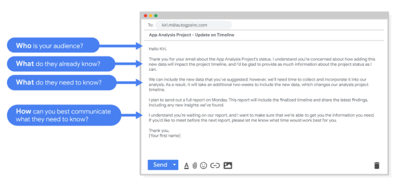
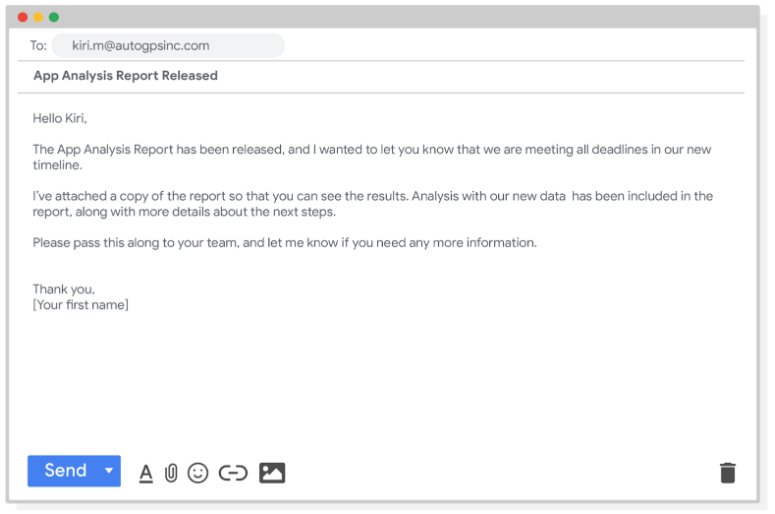

# La clave es una Comunicación clara

## La clave es una Comunicación clara
- ​Bienvenido de nuevo.
- Hemos hablado mucho ​sobre cómo entender a tu parte interesada y a ​tu equipo para que puedas equilibrar sus necesidades y ​mantener un enfoque claro en los objetivos de tu proyecto.
- ​Una gran parte de eso consiste en construir ​buenas relaciones con las personas con las que trabajas.
- ​¿Cómo se hace eso? Dos palabras: comunicación clara.
- ​Ahora vamos a aprender sobre la importancia de una ​comunicación clara con la parte ​interesada y los miembros del equipo.
- ​Empieza a pensar ​con quién quieres comunicarte y cuándo.

- ​En primer lugar, puede ser útil pensar en ​los desafíos de comunicación que quizás ​ya experimente en su vida diaria.
- ​¿Alguna vez has estado contando ​un chiste muy divertido solo para ​descubrir que tu amigo ya sabe el chiste final? ​¿O tal vez simplemente no entendieron qué tenía de divertido? ​Esto sucede todo el tiempo, ​especialmente si no conoces a tu audiencia.
- ​Este tipo de cosas también pueden ocurrir en el lugar de trabajo.
- ​Este es el secreto de una comunicación eficaz.
- ​Antes de preparar una presentación, ​enviar un correo electrónico o incluso ​contarle ese chiste gracioso a tu compañero de trabajo, ​piensa en quién es tu audiencia, ​qué es lo ​que ya sabe, qué necesita saber y cómo puedes comunicárselo de manera efectiva.

- ​Cuando comiences a pensar en tu audiencia, ​ellos lo sabrán y apreciarán el tiempo que ​dedicaste a considerarlos a ellos y a sus necesidades.
- ​Supongamos que está trabajando en un gran proyecto, ​analizando los datos de ventas anuales y ​descubre que faltan todos los datos de ventas en línea.
- ​Esto podría afectar a todo el equipo y ​retrasar considerablemente el proyecto.
- ​Al analizar estas cuatro preguntas, ​puedes trazar la mejor manera de ​comunicarte con tu equipo sobre este problema.
- ​En primer lugar, tendrás que pensar en quién es tu audiencia.
- ​En este caso, querrá ponerse en contacto con ​otros analistas de datos que trabajen en el proyecto, ​así como con su director de proyecto ​y, eventualmente, con el vicepresidente de ventas, ​que es su parte interesada.
- ​A continuación, analizará ​lo que este grupo ya sabe.

- ​Los demás analistas de datos que trabajan en este proyecto conocen ​todos los detalles sobre el ​conjunto de datos que ya está utilizando, ​y su director de proyecto conoce ​el cronograma en el que está trabajando.
- ​Por último, el vicepresidente de ventas ​conoce los objetivos de alto nivel del proyecto.
- ​Luego te preguntarás qué ​necesitan saber para seguir adelante.
- ​Sus colegas analistas de datos deben ​conocer los detalles de los puntos en los que ha probado ​hasta ahora y las posibles soluciones que se les hayan ocurrido.
- ​Su director de proyecto ​necesitaría conocer los diferentes equipos ​que podrían verse afectados y ​las implicaciones para el proyecto, ​especialmente si este problema cambia el cronograma.
- ​Por último, el vicepresidente de ventas tendrá que saber que existe ​un problema potencial que podría retrasar o afectar el proyecto.
- ​Ahora que has decidido quién necesita saber qué, ​puedes elegir la mejor forma de comunicarte con esa persona.

- ​En lugar de recibir un correo electrónico largo e inquietante que ​podría generar muchas idas y venidas, ​decide reservar rápidamente una reunión ​con su director de proyecto y otros analistas.
- ​En la reunión, informas al equipo sobre ​los datos de ventas en línea que faltan ​y les das más información básica.
- ​Juntos, discuten cómo ​esto afecta a otras partes del proyecto.
- ​Como equipo, elaboran un plan ​y actualizan el cronograma del proyecto si es necesario.
- ​En este caso, ​no es necesario invitar a la vicepresidenta de ventas a la reunión, ​pero agradecería recibir una actualización por correo electrónico ​si hubiera cambios en ​el cronograma que la directora del proyecto ​pudiera enviar ella misma.
- ​Cuando te comunicas de manera reflexiva ​y piensas primero en tu audiencia, ​construirás mejores relaciones y ​confianza con los miembros de tu equipo y la parte interesada.
- ​Esto es importante porque esas relaciones son clave ​para el éxito del proyecto y también para el tuyo.
- ​Cuando te estés preparando para enviar un correo electrónico, ​organizar una reunión o preparar una presentación, ​piensa en quién es tu audiencia, ​qué es lo que ya saben, ​qué necesitan saber y cómo ​puedes comunicárselo de forma eficaz.
- ​A continuación, hablaremos más ​sobre la comunicación en el trabajo y ​aprenderás algunos consejos útiles para ​asegurarte de que tu mensaje se transmite con claridad. 

---

## Consejos para una comunicación eficaz
- No importa dónde trabajes, ​es probable que necesites comunicarte con otras personas como parte de tu día a día.
- ​Cada organización y cada equipo de esa organización tendrán diferentes ​expectativas de comunicación.
- Próximamente, ​aprenderemos algunas formas prácticas de ayudarte a adaptarte a esas diferentes expectativas ​y algunas cosas que puedes transferir de un equipo a otro.
- ​Vamos a empezar.
- ​Cuando comienzas un nuevo trabajo o un nuevo proyecto, es posible que sientas que ​no estás sincronizado con el resto de tu equipo y con la forma en que se comunican.
- ​Eso es totalmente normal.
- ​Descubrirás las cosas en poco tiempo.
- ​si estás dispuesto a aprender sobre la marcha y a ​hacer preguntas cuando no estás seguro de algo.

- ​Por ejemplo, si descubres que tu equipo usa acrónimos con los que no estás familiarizado, ​no dudes en preguntar qué significan.
- ​Cuando empecé en Google, no tenía ni idea de lo que ​significaba L G T M y siempre lo veía en los hilos de comentarios.
- ​Bueno, aprendí que significa «me parece bien» y ​ahora lo uso todo el tiempo si necesito darle a alguien mis comentarios rápidos, ​ese fue uno de los muchos acrónimos que aprendí y siempre ​me encuentro con otros nuevos y nunca me da miedo preguntar.
- ​Cada entorno de trabajo tiene algún tipo de etiqueta.
- ​Tal vez los miembros de tu equipo aprecien el contacto visual y un firme protocolo de enlace.
- ​O podría ser más cortés inclinarse, ​especialmente si trabajas con clientes internacionales.
- ​También puedes descubrir algunas reglas de etiqueta específicas simplemente viendo a ​tus compañeros de trabajo comunicarse.
- Y no solo se ​ocupará de la comunicación en persona.

- ​Cada día se envían y reciben casi 300 mil millones de correos electrónicos y ​ese número no hace más que crecer.
- Afortunadamente, ​también hay habilidades útiles que puedes aprender de esas comunicaciones digitales.
- Querrás que ​tus correos electrónicos sean tan profesionales como tus comunicaciones en persona.
- ​Estas son algunas cosas que pueden ayudarte a hacerlo.
- Las buenas prácticas de redacción contribuirán en gran ​medida a que sus correos electrónicos sean profesionales y fáciles de entender.
- ​Los correos electrónicos son naturalmente más formales que los textos, pero ​eso no significa que tengas que escribir la próxima gran novela.
- ​El solo hecho de tomarte el tiempo para escribir oraciones completas que tengan la ortografía y ​la puntuación adecuadas dejará ​en claro que te tomaste tiempo y consideración al escribirlas.
- Los correos electrónicos a menudo se reenvían a otras personas para que los lean.

- ​Así que escribe con suficiente claridad para que cualquiera pueda entenderte.
- ​Me gusta leer los correos electrónicos importantes en voz alta antes de pulsar enviar; de esa forma, ​puedo saber si tienen sentido y detectar cualquier error tipográfico.
- Y ​ten en cuenta que el tono de tus correos electrónicos puede cambiar con el tiempo.
- ​Si descubres que tu equipo es bastante informal, eso es genial.
- ​Una vez que los conozcas mejor, también puedes empezar a ser más informal, pero ​ser profesional siempre es un buen punto de partida.
- Una buena regla general: ​¿Estaría orgulloso de lo que ha escrito si se publicara en la primera página de ​un periódico? ​Si no, revísalo hasta que estés.
- Tampoco quieres que tus correos electrónicos sean demasiado largos.

- ​Piensa en lo que el miembro de tu equipo necesita saber y ve al grano en lugar de ​abrumarlo con un muro de texto.
- Querrás asegurarte de que tus correos electrónicos ​sean claros y concisos para que no se pierdan en el lío.
- ​Vamos a echar un vistazo rápido a dos correos electrónicos para que puedas ver lo que quiero decir.
- ​Este es el primer correo electrónico.
- Hay ​tanto escrito aquí que es un poco difícil ver dónde está la información importante.
- ​Y este primer párrafo no me da un resumen rápido de las conclusiones importantes.
- ​Es bastante casual que el saludo sea ​simplemente: «Hola» y no hay ninguna señal de cierre.

- ​Además, ya puedo detectar algunos errores tipográficos.
- ​Ahora echemos un vistazo al segundo correo electrónico.
- Ya ​es menos abrumador, ¿verdad? ​Solo unas pocas frases, diciéndome lo que necesito saber.
- ​Está claramente organizado y hay un saludo cortés y una firma.
- ​Este es un buen ejemplo de correo electrónico; breve y directo, educado y bien escrito.
- ​Todas las cosas de las que hemos estado hablando hasta ahora.

- ​Pero, ¿qué haces si lo que tienes que decir es demasiado largo para un correo electrónico? ​Bueno, tal vez prefieras programar una reunión.
- ​También es importante responder de manera oportuna.
- ​No querrás ​tardar tanto en responder a los correos electrónicos que tus compañeros de trabajo comiencen a preguntarse si estás bien.
- ​Siempre intento responder a los correos electrónicos en 24 a 48 horas.
- ​Incluso si es solo para darles un cronograma en ​el que tendré las respuestas reales que están buscando.
- ​De esa manera, ​puedo establecer expectativas y ellos saben que estoy trabajando en ello.

- ​Eso también funciona al revés.
- ​Si necesitas una respuesta sobre algo específico por parte de uno de los miembros de tu equipo, ​deja claro lo que necesitas y cuándo lo necesitas para que puedan ponerse en contacto contigo.
- ​Incluso incluiré una fecha en mi línea de asunto y ​fechas en negrita en el cuerpo de mi correo electrónico, ​para que quede muy claro.
- Recuerda que tener claras tus necesidades es una parte importante ​de ser un buen comunicador.
- ​Cubrimos algunas formas excelentes de mejorar nuestras habilidades de comunicación profesional, como ​hacer preguntas, practicar buenos hábitos de escritura y algunos consejos y trucos por correo electrónico.
- ​Esto te ayudará a comunicarte de forma clara y ​eficaz con los miembros de tu equipo en cualquier proyecto.
- ​Puede llevar algo de tiempo, pero encontrarás un estilo de comunicación que funcione para ti y ​tu equipo, tanto en persona como en línea.
- ​Mientras estés dispuesto a aprender, no tendrás problemas para adaptarte a ​las diferentes expectativas de comunicación que verás en futuros trabajos. 

---

## Utilice múltiples estrategias de Comunicación para llegar a su público

- Ser capaz de comunicarse en múltiples formatos es una habilidad clave para los analistas de datos.
- Escuchar, hablar, hacer presentaciones y escribir le ayudarán a tener éxito en sus proyectos y en su carrera.
- Esta lectura cubre las estrategias de comunicación eficaz, incluyendo ejemplos de correos electrónicos redactados con claridad para situaciones comunes.
- He aquí un primer consejo importante: ¡Conozca a su público! Cuando comunique sus análisis y recomendaciones como Analista de datos, es vital que tenga presente a su público.
- Asegúrese de responder a estas cuatro preguntas importantes relacionadas con su público:
   - ¿Quién es su público? 
   - ¿Qué saben ya? 
   - ¿Qué necesitan saber? 
   - ¿Cuál es la mejor forma de comunicar lo que necesitan saber? 

- Ejemplo de Proyecto 
   - COMO ANALISTA DE DATOS, recibirá muchas solicitudes y preguntas a través del correo electrónico.
   - Veamos un ejemplo de cómo podría enfocar la respuesta a uno de estos correos electrónicos.
   - Supongamos que es usted un Analista de datos que trabaja en una empresa que desarrolla aplicaciones para dispositivos móviles.
   - Empecemos revisando las respuestas a las cuatro preguntas del público que acabamos de tratar:

   - ¿Quien es tu audiencia?
      -  Kiri, Gerente de proyectos de desarrollo de productos
   - ¿Qué es lo que ya saben?
      - Kiri recibió actualizaciones sobre nuestro proyecto desde sus fases de planificación, incluido el informe más reciente del proyecto, enviado hace dos semanas.
   - ¿Qué necesitan saber?
      - Kiri necesita una actualización sobre el progreso del proyecto de análisis y necesita saber que el equipo ejecutivo aprobó los cambios en los datos y en el calendario.
      - Sabe que añadir una nueva variable al análisis repercutirá en el calendario actual del proyecto.
      - Kiri tendrá que cambiar los hitos del proyecto y la fecha de finalización.
   - Como puedes comunicar mejor lo que necesitan saber?
      - Puede empezar enviando un correo electrónico de actualización a Kiri con el calendario más reciente del proyecto, pero puede que sea necesaria una reunión si ella quiere hablar de sus preocupaciones sobre el incumplimiento de un plazo.
   
- Muestra de correo electrónico con el calendario actualizado
   - Después de responder a las preguntas del público, ya tiene las piezas clave que necesita para escribir un correo electrónico a Kiri.
   - He aquí un ejemplo de cómo estas preguntas pueden ayudar a organizar el flujo del mensaje de correo electrónico:

   
   - Después de recibir su correo electrónico, Kiri tendrá una visión más clara de los cambios en el proyecto de análisis y podrá hacer ajustes para trabajar con el nuevo calendario.

- Muestra de correo electrónico de seguimiento del Proyecto
   - Una vez finalizado el siguiente informe, también puede enviar una actualización del proyecto ofreciendo más información.
   - El correo electrónico podría tener este aspecto:

   - Una buena Comunicación mantiene a las partes interesadas al corriente de los progresos y, en última instancia, ayuda a evitar problemas.
   - La clave está en redactar cuidadosamente las respuestas.
   - Tanto si recopila y aborda los comentarios utilizando el correo electrónico, las reuniones o los informes, todas las personas con las que trabaje sabrán a qué atenerse.
   - Como resultado, podrán gestionar mejor sus propios Cronogramas, Recursos y Equipos.

---

## Navegar por las expectativas y los objetivos realistas del Proyecto
- ​Ya hemos hablado de las limitaciones de los datos.
- ​A veces no tiene acceso a los datos que necesita, o ​sus fuentes de datos no están alineadas o sus datos no están limpios.
- ​Esto puede ser un problema a la hora de analizar los datos, pero ​también puede afectar a su comunicación con las partes interesadas.
- ​Por eso es importante equilibrar las expectativas de las partes interesadas con lo que ​realmente es posible para un proyecto.
- ​Vamos a aprender la importancia de establecer metas realistas y objetivas y ​la mejor manera de comunicarse con sus partes interesadas sobre los problemas ​con los que se puede encontrar.
- ​Tenga en cuenta que muchas cosas dependen de su análisis.
- ​Quizá su equipo no pueda tomar una decisión sin su informe.

- ​O quizá su trabajo inicial con los datos determine cómo y ​dónde se recopilarán datos adicionales.
- ​Quizá recuerde que hemos hablado de algunas ​situaciones en las que es importante incluir a las partes interesadas.
- Por ejemplo, ​decirle a su jefe de proyecto si está cumpliendo los plazos o si está teniendo algún problema.
- ​Ahora, veamos un ejemplo de la vida real en el que necesita comunicarse con ​las partes interesadas y qué podría hacer si se encuentra con un problema.
- ​Digamos que está trabajando en un proyecto para una compañía de seguros.
- ​La compañía quiere identificar las causas comunes de los accidentes de tráfico leves para ​poder desarrollar materiales educativos que fomenten una conducción más segura.
- ​Hay algunas preguntas iniciales que usted y su equipo deben responder.

- ​¿Qué hábitos de conducción incluirá en su conjunto de datos? ​¿Cómo recopilará estos datos? ​¿Cuánto tiempo tardará en recopilar y ​limpiar esos datos antes de poder utilizarlos en su análisis
- Desde el principio, ​deberá comunicarse claramente con las partes interesadas para responder a estas preguntas, ​de modo que usted y su equipo puedan establecer un calendario razonable y realista para el proyecto.
- ​Puede resultar tentador decir a las partes interesadas que lo tendrá listo en ​poco tiempo y sin problemas.
- ​Pero establecer expectativas para un calendario realista le ayudará a largo plazo.
- ​Sus partes interesadas sabrán qué esperar y cuándo, y usted no trabajará en exceso ​ni incumplirá los plazos por haber prometido más de la cuenta.
- ​Me parece que fijar las expectativas con antelación me ayuda a emplear mi tiempo de forma más productiva.
- ​Así que, a medida que vaya empezando, querrá enviar un cronograma de alto nivel con ​las distintas fases del proyecto y sus fechas aproximadas de inicio.
- ​En este caso, usted y sus equipos establecen que necesitará tres semanas para ​completar el análisis y ofrecer recomendaciones, y ​se lo hace saber a sus partes interesadas para que puedan planificar en consecuencia.
- ​Imaginemos ahora que se encuentra en una fase más avanzada del proyecto y se encuentra con un problema.
- ​Quizás los controladores han optado por compartir datos sobre el uso de su teléfono en el coche, pero ​usted descubre que algunas fuentes contabilizan el uso del GPS y otras no en sus datos.
- ​Esto podría añadir tiempo a su procesamiento y limpieza de datos y ​retrasar algunos hitos del proyecto.
- ​Querrá hacérselo saber a su jefe de proyecto y ​quizás elaborar un nuevo calendario para presentarlo a las partes interesadas.

- ​Cuanto antes pueda señalar estos problemas, mejor.
- ​De este modo, sus partes interesadas podrán hacer los cambios necesarios lo antes posible.
- ​O qué ocurre si sus partes interesadas quieren añadir el modelo de coche o la edad como posibles variables.
- ​Tendrá que comunicarse con ellos sobre cómo eso podría cambiar el Modelo ​que ha construido, ​si puede añadirse y antes de los plazos, y ​cualquier otro obstáculo que necesiten saber para que ​puedan decidir si merece la pena cambiarlo en esta fase del Proyecto.
- Para ayudarles ​podría preparar un Informe sobre cómo su petición modifica el calendario del proyecto o ​altera el Modelo.
- ​También podría esbozar los pros y los contras de ese cambio.
- ​Usted quiere ayudar a sus partes interesadas a alcanzar sus objetivos, pero es importante establecer ​expectativas realistas en cada fase del proyecto.

- ​Esto requiere cierto equilibrio.
- ​Ha aprendido a equilibrar las necesidades de los miembros de su Equipo y de las partes Interesadas, pero ​también necesita equilibrar las expectativas de las partes Interesadas y ​lo que es posible con los proyectos, ​los recursos y las limitaciones.
- ​Por eso es importante ser realista y objetivo y comunicarse con claridad.
- ​Esto ayudará a las partes interesadas a entender el calendario y ​a tener confianza en su capacidad para alcanzar esos objetivos.
- ​Así que sabemos que la comunicación es clave y ​tenemos algunas buenas reglas a seguir para nuestra comunicación profesional.
- ​Próximamente ​hablaremos aún más sobre cómo responder a las preguntas de las partes interesadas, ​entregar datos y comunicarse con su equipo. 