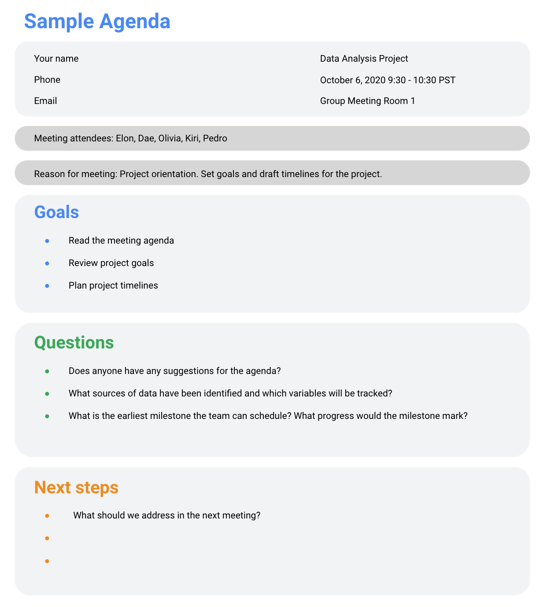

# Increíble trabajo en equipo

## Cumplir las mejores prácticas
- Ahora es el momento de hablar de las reuniones.
- ​Las reuniones son una parte importante de la forma en que te ​comunicas con los miembros del equipo y las partes interesadas.
- ​Veamos algunas cosas fáciles de hacer y qué no hacer, ​que puedes usar en reuniones tanto en persona como en línea para ​que puedas usar ​estas mejores prácticas de comunicación en el futuro.
- ​En esencia, las reuniones permiten que tú y ​los miembros de tu equipo o parte interesada ​debatan sobre el desarrollo de un proyecto.
- ​Pero pueden ser mucho más que eso.
- ​Ya sean virtuales o presenciales, ​las reuniones de equipo pueden fomentar la confianza y el espíritu de equipo.
- ​Te dan la oportunidad de conectarte con ​las personas con las que trabajas más allá de los correos electrónicos.

- ​Otro beneficio es que ​saber con quién estás trabajando te puede dar ​una mejor perspectiva de dónde ​encaja tu trabajo en un proyecto más amplio.
- ​Las reuniones periódicas también ​facilitan la coordinación de los objetivos del equipo, ​lo que facilita el logro de los objetivos.
- ​Con todos en sintonía, ​tu equipo ​también estará en la mejor posición para ayudarse mutuamente cuando tengas problemas.
- ​Ya sea que dirija una reunión o simplemente asista a ella, ​existen prácticas recomendadas que puede ​seguir para asegurarse de que sus reuniones sean un éxito.
- ​Hay algunas cosas realmente sencillas ​que puede hacer para que la reunión sea excelente.
- ​Prepárate, llega a tiempo, ​presta atención y haz preguntas.
- ​Esto se aplica tanto a las reuniones ​que dirige como a las que asiste.

- ​Analicemos cómo puedes seguir ​estas tareas pendientes en cada reunión.
- ​¿Qué quiero decir cuando digo que vengas preparado? ​Bueno, un par de cosas.
- ​Primero, trae lo que necesitas.
- ​Si te gusta tomar notas, ​ten a ​mano tu cuaderno y bolígrafos en el bolso o tu dispositivo de trabajo.
- ​Estar preparado también significa ​que debes leer la agenda de la reunión con ​antelación y estar preparado para proporcionar cualquier actualización sobre tu trabajo.
- ​Si dirige la reunión, ​asegúrese de preparar sus notas y presentaciones ​y de saber de qué va a hablar y, por supuesto, ​prepárese para responder a las preguntas.

- ​Estos son otros consejos que me ​gusta seguir cuando dirijo una reunión.
- ​En primer lugar, cada reunión debe centrarse en tomar ​una decisión clara e incluir a ​la persona necesaria para tomar esa decisión.
- ​Y si es necesario que haya una reunión para tomar ​una decisión, prográmela de inmediato.
- ​No dejes que el progreso se detenga ​esperando hasta la reunión de la semana que viene.
- ​Por último, intenta mantener el número de ​personas en la reunión por debajo de 10 si es posible.
- ​Más personas hacen que sea difícil ​tener una discusión colaborativa.
- ​También es importante respetar el tiempo de los miembros de tu equipo.

- ​La mejor manera de hacerlo es llegar a tiempo a las reuniones.
- ​Si diriges la reunión, ​preséntate temprano y prepárate de ​antemano para que estés listo para empezar cuando llegue la gente.
- ​Puede hacer lo mismo para las reuniones en línea.
- ​Intenta asegurarte de que tu tecnología funciona de antemano ​y de que estás vigilando el reloj para ​no perderte una reunión accidentalmente.
- ​Mantenerse concentrado y atento durante una reunión es ​otra excelente manera de respetar el tiempo de los miembros del equipo.
- ​No querrás perderte ​algo importante porque te ​distrajo con otra cosa durante una presentación.
- ​Prestar atención también significa ​hacer preguntas cuando necesites una aclaración ​o si crees que puede haber ​un problema con el plan de un proyecto.

- ​No tengas miedo de comunicarte con nosotros después de una reunión.
- ​Si no pudiste hacer tu pregunta, haz ​un seguimiento con el grupo después y obtén tu respuesta.
- ​Si eres la persona que dirige la reunión, ​asegúrate de crear y enviar una agenda con antelación, ​para que los miembros de tu equipo puedan llegar preparados ​y salir con conclusiones claras.
- ​También querrás mantener a todos involucrados.
- ​Intente interactuar con todos los asistentes para ​no perderse ninguna información de los miembros de su equipo.
- ​Hazles saber a todos que ​también estás dispuesto a recibir preguntas después de la reunión.
- ​Es una buena idea tomar ​notas incluso cuando diriges la reunión.

- ​Esto hace que sea más fácil ​recordar todas las preguntas que se hicieron.
- ​Luego, puedes hacer un seguimiento ​con los miembros individuales del equipo para responder a ​esas preguntas o enviar una actualización a ​todo tu equipo en función de quién necesite esa información.
- ​Ahora repasemos lo que no se debe hacer en las reuniones.
- ​Hay algunos «no» obvios aquí.
- ​No querrás llegar desprevenido ​, tarde o distraído a las reuniones.
- ​Tampoco querrás dominar la conversación, ​hablar por encima de los demás ni distraer a ​las personas con una discusión desenfocada.
- ​Intenta asegurarte de dar a los demás miembros del equipo la oportunidad de ​hablar y deja que siempre terminen de ​pensar antes de empezar a hablar.

- ​Todos los que asistan a la ​reunión deben dar su opinión.
- ​Brinde oportunidades para que las personas hablen, ​hagan preguntas, soliciten expertos ​y soliciten sus comentarios.
- ​No querrás perderte ​sus valiosos conocimientos.
- Y trata de que todos ​pongan sus teléfonos u ordenadores en silencio cuando ​no estén hablando, incluido tú.
- ​Ahora hemos aprendido algunas prácticas recomendadas que puede ​seguir en las reuniones, como ​prepararse, llegar a tiempo, prestar atención y hacer preguntas.
- ​También hablamos sobre el uso ​productivo de las reuniones para tomar decisiones claras y ​promover los debates colaborativos, así como para comunicarnos ​después de una reunión para responder a ​las preguntas que usted u otras personas pudieran haber tenido.
- ​También sabe lo que no debe hacer en ​las reuniones: llegar sin preparación, ​tarde o distraído, o ​hablar por encima de los demás y perder de vista sus comentarios.
- ​Con estos consejos en mente, ​estarás bien encaminado hacia ​reuniones de equipo productivas y positivas.
- ​Pero, por supuesto, a veces ​habrá conflictos en tu equipo.
- ​Hablaremos pronto de la resolución de conflictos.

---

## Ximena Uniéndose a un nuevo Equipo
- Unirse a un nuevo equipo fue definitivamente aterrador al principio.
- ​Especialmente en una empresa como Google, donde es muy grande y ​todos son extremadamente inteligentes.
- ​Pero realmente me apoyé en mi gerente para entender lo que podía aportar.
- ​Y eso me hizo sentir mucho más cómoda en las reuniones y, al mismo tiempo, compartir mis ​habilidades.
- ​He descubierto que mis mejores proyectos comienzan cuando la comunicación es muy clara ​sobre lo que se espera.
- ​Si salgo ​de la reunión en la que se me ha pedido que sepa exactamente ​por dónde empezar y qué tengo que hacer, eso me permite hacerlo de forma más rápida y eficiente, ​alcanzar el verdadero objetivo ​y, tal vez, ir un paso más allá, ya que no tuve que perder tiempo ​confundido con lo que tenía que hacer.
- ​La Comunicación es muy importante porque te lleva a la línea de meta de la ​manera más eficiente y también te hace lucir muy bien.
- ​Cuando empecé, tenía una buena cantidad de proyectos por delante y ​estaba muy emocionada.
- ​Así que los analicé sin hacer demasiadas preguntas.
- ​Al principio, eso fue un obstáculo, porque si bien puedes prosperar en la ​ambigüedad, la ambigüedad en cuanto a cuál es el objetivo del proyecto puede ser muy perjudicial ​cuando realmente estás intentando lograr el objetivo.
- ​Y lo superé simplemente dando un paso atrás cuando alguien me pidió que hiciera ​el proyecto y simplemente aclarando cuál era ese objetivo.
- ​Una vez que ese objetivo estuvo nítido, ​me gustó entrar en la ambigüedad de cómo llegar allí, ​pero el objetivo tiene que ser realmente objetivo y claro.
- ​Soy Ximena y soy analista financiera.

---

## Liderar grandes reuniones
- Un día no muy lejano, puede que se encuentre planificando una reunión en su función de Analista de datos.
- Pueden ocurrir grandes cosas cuando los participantes anticipan una reunión bien ejecutada.
- Los asistentes llegan a tiempo.
- No se distraen con sus portátiles y teléfonos.
- Sienten que su tiempo estará bien empleado.
- Todo se reduce a una buena planificación y comunicación de las expectativas.
- A continuación le ofrecemos nuestros mejores consejos prácticos para dirigir reuniones.

- Antes de la reunión
   - Si es usted quien organiza la reunión, probablemente hablará de los Datos.
   - Antes de la reunión:
      - Identifique su objetivo. Establezca el propósito, las metas y los resultados deseados de la reunión, incluidas las preguntas o peticiones que deban abordarse.
      - Reconozca a los participantes y manténgalos involucrados con diferentes puntos de vista y experiencias con los datos, el proyecto o el negocio.
      - Organice los Datos que se van a presentar. Puede que tenga que convertir los datos brutos en formatos accesibles o crear visualizaciones de datos.
      - Preparar y distribuya una agenda. Repasaremos esto a continuación.

- Elaboración de un orden del día convincente
   - Un orden del día sólido prepara su reunión para el éxito.
   - Éstas son las partes básicas que debe incluir su orden del día:
      - Hora de inicio y fin de la reunión
      - Lugar de la reunión (incluida la Información para participar a distancia, si se dispone de esa opción)
      - Objetivos
      - Material de referencia o datos que los participantes deban revisar de antemano
   - He aquí un ejemplo de agenda para un proyecto de análisis que acaba de empezar:

- Compartir su agenda con antelación
   - Después de redactar su agenda, es hora de compartirla con los invitados.
   - Compartir la agenda con todos con antelación les ayuda a comprender los objetivos de la reunión y a preparar preguntas, comentarios o reacciones.
   - Puede enviar la agenda por correo electrónico o compartirla utilizando otra herramienta de colaboración.

- Durante la reunión
   - Como líder de la reunión, su trabajo consiste en guiar el debate sobre los Datos.
   - Con todo el mundo bien informado del plan y los objetivos de la reunión, puede seguir estos pasos para evitar cualquier distracción:
      - Haga las presentaciones (si es necesario) y repase los mensajes clave
      - Presente los Datos
      - Discuta las observaciones, interpretaciones e implicaciones de los datos
      - Tome notas durante la reunión
      - Determine y resuma los próximos pasos para el grupo

- Después de la reunión
   - Para mantener el proyecto y a todos alineados, prepare y distribuya una breve recapitulación de la reunión con los siguientes pasos que se acordaron en la reunión.
   - Incluso puede dar un paso más y pedir comentarios al equipo.
      - Distribuya las notas o los datos.
      - Confirme los próximos pasos y el calendario de acciones adicionales
      - Pida comentarios (es una forma eficaz de averiguar si se le ha pasado algo por alto en su recapitulación)

- Unas palabras finales sobre las reuniones
   - Incluso con la planificación más cuidadosa y los órdenes del día más detallados, a veces las reuniones pueden descarrilarse.
   - Una situación de emergencia puede robar la atención de la gente.
   - Una decisión reciente podría cambiar inesperadamente requisitos que se habían discutido y acordado previamente.
   - Elementos de acción podrían no aplicarse a la situación actual.
   - Si esto ocurre, puede verse obligado a acortar o cancelar la reunión.
   - No pasa nada, pero asegúrese de hablar de todo lo que afecte a su proyecto con su director o con las partes interesadas y vuelva a programar la reunión cuando disponga de más información. 

---

## DEL CONFLICTO A LA COLABORACIÓN
- Es normal que surjan conflictos en tu vida laboral.
- ​Mucho de lo que has aprendido hasta ahora, ​como gestionar las expectativas y comunicarte de ​manera eficaz, puede ayudarte a evitar conflictos, ​pero a veces te encontrarás con conflictos de todos modos.
- ​Si eso ocurre, hay maneras de ​resolverlo y seguir adelante.
- ​En este video, hablaremos sobre cómo puede ​ocurrir un conflicto y las mejores maneras de ​practicar la resolución de conflictos.
- ​Un conflicto puede surgir por diversas razones.
- ​Tal vez una de las partes interesadas malinterpretó ​los posibles resultados de tu proyecto; ​tal vez tú y el miembro de tu equipo tenéis ​estilos de trabajo muy diferentes; ​o tal vez ​se acerca una fecha límite importante y la gente está nerviosa.
- ​Las expectativas incompatibles y los problemas de comunicación ​son algunas de las razones más comunes por las que ocurren conflictos.

- ​Tal vez no tenías claro quién debía ​limpiar un conjunto de datos y nadie lo limpió, lo que ​retrasa un proyecto.
- O tal vez ​un compañero ​de equipo envió un correo electrónico con todas tus ideas incluidas, ​pero sin mencionar que era tu trabajo.
- ​Si bien puede ser fácil tomarse los conflictos como algo personal, ​es importante tratar de ser objetivo ​y concentrarse en los objetivos del equipo.
- ​Lo creas o no, los momentos tensos ​pueden ser oportunidades para ​reevaluar un proyecto y tal vez incluso mejorar las cosas.
- ​Por lo tanto, cuando surge ​un problema, hay varias maneras de cambiar la situación ​para que sea más productivo y colaborativo.
- ​Una de las mejores maneras de cambiar ​una situación de problemática a productiva ​es simplemente replanteando el problema.
- En lugar de ​centrarte en lo que salió mal o a quién culpar, ​cambia la pregunta con la que estás empezando.

- ​Intenta preguntar, ¿cómo puedo ayudarte a alcanzar tu meta? ​Esto crea una oportunidad ​para que tú y los miembros de tu equipo trabajen ​juntos para encontrar una solución en lugar ​de sentirse frustrados por el problema.
- ​La discusión es clave para la resolución de conflictos.
- ​Si te encuentras en medio de ​un conflicto, intentas comunicarte, ​iniciar una conversación o preguntar cosas como: ​¿hay otras cosas importantes que deba considerar? ​Esto brinda a los miembros de su equipo o ​a la parte interesada la oportunidad de exponer sus inquietudes de manera completa.
- ​Pero si te sientes emocional, ​tómate un tiempo para ​calmarte y así poder iniciar la conversación con una mente más clara.
- ​Si tengo que escribir un correo electrónico en un momento de tensión, ​lo guardo como borradores ​y lo vuelvo a ​leer al día siguiente para volver a leerlo antes de enviarlo y ​asegurarme de que estoy siendo sensato.

- ​Si descubres que no entiendes lo que un ​miembro de tu equipo o parte interesada te pide que hagas, ​intenta entender el contexto de su solicitud.
- ​Pregúnteles cuál es su objetivo final, ​qué historia intentan contar con ​los datos o cuál es el panorama general.
- ​Al convertir los momentos de posible conflicto en ​oportunidades para colaborar y seguir adelante, ​puedes resolver la tensión ​y volver a poner en marcha tu proyecto.
- ​En lugar de decir: «No hay manera de que pueda hacerlo en este ​período de tiempo», intenta reformularlo diciendo: ​«Con gusto lo haré, ​pero me tomaré este tiempo, ​demos un paso atrás para que pueda ​entender mejor lo que te gustaría hacer ​con los datos y podamos trabajar juntos ​para encontrar la mejor ruta de acceso».
- ​Con eso, hemos llegado al final de esta sección.
- ​Buen trabajo.
- ​Aprender a trabajar con ​nuevos miembros del equipo puede ser un gran desafío a la hora de empezar ​un nuevo puesto o un nuevo proyecto, pero ​con las habilidades que has adquirido en estos vídeos, ​podrás empezar con ​buen pie con cualquier equipo nuevo al que te unas.

- ​Hasta ahora, has aprendido a equilibrar las necesidades ​y expectativas de los miembros de tu equipo y de la parte interesada.
- ​También has explicado cómo dar sentido a las ​funciones de tu equipo y centrarte en el objetivo del proyecto, ​la importancia de tener una ​comunicación clara y ​las expectativas de comunicación en un lugar de trabajo ​y cómo equilibrar ​las limitaciones de los datos con las preguntas de las partes interesadas.
- ​Por último, explicamos cómo tener ​reuniones de equipo eficaces y ​cómo resolver conflictos pensando en ​colaboración con los miembros del equipo.
- ​Esperemos que ahora comprenda lo importante que ​es la comunicación para el éxito de un analista de datos.
- ​Estas habilidades de comunicación pueden parecer un poco ​diferentes de algunas de ​las otras habilidades que ha estado aprendiendo en este programa, ​pero también son una parte importante de ​su conjunto de herramientas para analistas de datos y de ​su éxito como analista de datos profesional.
- ​Al igual que todas ​las demás habilidades que estás aprendiendo en este momento, ​tus habilidades de comunicación crecerán ​con la práctica y la experiencia.

---

## Nathan Del Cuerpo de Marines de EE.UU. a la Analítica de datos
​Hola, soy Nathan.
- ​Soy analista principal de datos ​en la Organización de Confianza y Seguridad de Google.
- ​Me uní a la Reserva del Cuerpo de Marines ​cuando asistía a la universidad, ​y la unidad de reserva a la que me uní era una unidad de artillería de campaña.
- ​Así que después de un desafiante campamento de entrenamiento del Cuerpo de Marines, ​fui a la escuela de control de dirección de fuego de artillería de campaña.
- ​Y para aquellos que no lo sepan, el ​control de la dirección del fuego se considera ​el cerebro de la artillería de campaña.
- ​Y utilizamos todo tipo de ordenadores ​para hacer nuestros cálculos de artillería.
- ​Pero en caso de que las computadoras dejaran de ​funcionar, también nos enseñaron a usar las reglas de cálculo como respaldo.

- ​Y luego, un año después, ​tuve la oportunidad de trabajar como conductor de camiones ​en lugar de mi trabajo principal como artillero de campaña, ​y me enviaron a Irak para ​conducir camiones para una compañía de infantería.
- ​Cuando regresé de Irak, ​terminé mi licenciatura ​y luego trabajé como ingeniera de aplicaciones en Austin, Texas, ​y finalmente vi la necesidad de cambiar más, de ​centrarme más en los negocios.
- Fue ​entonces cuando realmente me enamoré del análisis de datos, ​fue cuando aprendí mucho más sobre los negocios.
- ​De hecho, me llevó un par de años, ​cuando realmente desperté mi interés por el análisis de datos, ​conseguir un puesto en el que pudiera dedicarme a tiempo completo ​y ponerme manos a la obra con los datos.
- ​Mi primer trabajo en el que me dediqué al análisis de datos a tiempo completo ​fue en un banco grande ​y me sentí como en el cielo.
- ​Realmente tuve que usar SQL de verdad ​y también usé mucho Tableau.
- ​Tengo que ir a una conferencia de Tableau.

- ​Estuvo muy guay.
- ​Luego tuve la suerte de tener la oportunidad de ​pasarme a Google y ocupar mi puesto actual ​de Confianza y Seguridad.
- ​Y lo más emocionante y gratificante de eso ​es que, ya sabes, al igual que el ejército, ​tiene la misión general de proteger a las personas.
- ​Así que es muy emocionante para mí.
- ​Lo que me inculcaron en la Infantería de Marina y ​que uso hasta el día de hoy sería la atención a los detalles.
- ​Eso es muy importante en el ejército en general, ​pero especialmente en la artillería de campaña.
- ​En segundo lugar, está la importancia de la comunicación.

- ​Tienes tus propios datos guardados.
- ​Debes asegurarte de que se comuniquen con ​mucha claridad a otras personas con las que trabajas.
- ​Y la tercera sería la colaboración.
- ​En el ejército, el trabajo en equipo hace que los sueños se hagan realidad.
- ​Realmente confías en el equipo.
- ​Definitivamente, ese ha sido el caso ​en mi carrera y trabajos posteriores al Cuerpo de Marines.

---

## Ponga a prueba sus Conocimientos sobre el Trabajo en equipo

1. Cuando dirija una reunión, ¿cuáles son algunas formas de asegurarse de que todos los participantes tengan una experiencia positiva? Seleccione todas las que correspondan.
   - [x] Tome notas de lo que se discute
   - [ ] Demostrar una fuerte capacidad de liderazgo haciendo la mayor parte de la conversación
   - [x] Preparar notas, una presentación y una agenda para compartir con los asistentes
   - [x] Pruebe la tecnología con antelación para asegurarse de que funciona correctamente
> Cuando dirija una reunión, probar la tecnología, tomar notas y preparar materiales de apoyo le ayudará a garantizar que todos los participantes tengan una experiencia positiva.

2. Para cambiar una situación de problemática a productiva, los analistas de datos pueden replantear un problema e iniciar una conversación constructiva. ¿Cuál de las siguientes afirmaciones es eficaz para hacerlo? Seleccione todas las que correspondan.
   - [x] Me encantaría realizar este Proyecto. Consideraré los pasos necesarios y me pondré en contacto con usted en breve con una estimación de tiempo.
   - [ ] Es importante que sepa que este problema no fue culpa mía.
   - [x] Me gustaría ayudarle a alcanzar su meta. Hablemos de cómo puedo hacerlo.
   - [x] Puede que haya otras cosas importantes que deba tener en cuenta. Voy a investigarlo.
> Para replantear un problema, pueden ser útiles las tres afirmaciones siguientes: 1) Me encantaría realizar este Proyecto. Consideraré los pasos necesarios y me pondré en contacto con usted en breve con una estimación de tiempo. 2) Me gustaría ayudarle a alcanzar su objetivo. Hablemos de cómo puedo hacerlo. 3) Puede que haya otras cosas importantes que deba tener en cuenta. Voy a estudiarlo.

3. Está trabajando en un proyecto con un compañero de trabajo y la situación se vuelve tensa cuando los dos discrepáis sobre lo que os dicen los datos. ¿Cuál es el mejor curso de acción?
   - [ ] Solicite un socio diferente para éste y futuros proyectos; incluya documentación de apoyo clara.
   - [ ] Siga adelante con el Proyecto utilizando la interpretación de los Datos de su socio; es bueno llegar a un compromiso.
   - [ ] Vaya a ver a su supervisor y explíquele amablemente que su compañero de trabajo está mirando los datos de forma incorrecta. 
   - [x] Inicie una conversación que permita a cada uno exponer con calma sus puntos de vista y determinar un plan adecuado.
> Lo mejor es iniciar una conversación que permita a cada uno exponer con calma sus puntos de vista y determinar un plan adecuado.

4. Un director le envía un correo electrónico pidiéndole un Informe para el fin de semana. Este tipo de informe tarda al menos 10 días en completarse. ¿Cuál es la mejor forma de proceder?
   - [ ] Reenvíe el correo electrónico a otro analista de datos de su equipo y pídale que realice el informe en su lugar. 
   - [ ] Complete el Informe lo mejor que pueda antes del final de la semana para cumplir el plazo solicitado.
   - [x] Responda diciendo que estará encantado de hacerlo, pero que cree que tardará 10 días en completarse. A continuación, pregunte si puede discutir un plazo diferente.
   - [ ] Llame al director, haciéndole saber que es imposible que alguien pueda cumplir ese plazo.
> Lo mejor es responder diciendo que lo hará con mucho gusto, pero que cree que tardará 10 días en completarse. A continuación, pregunte si puede discutir un plazo diferente.