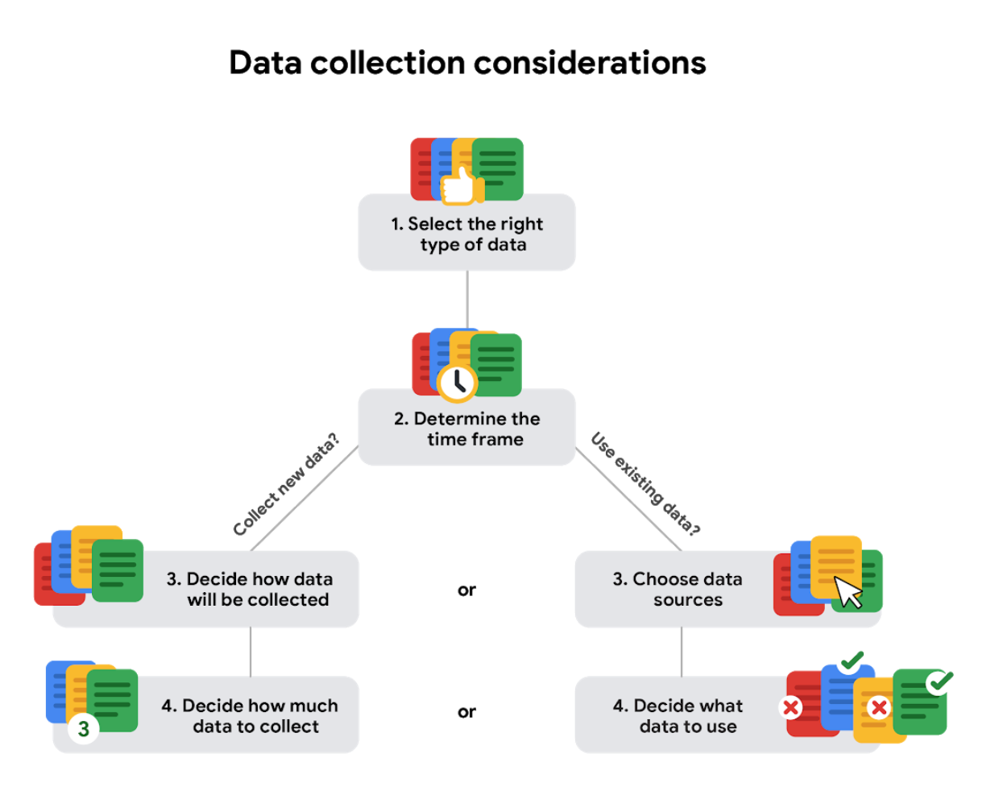

# Recopilar datos

## Recogida de datos en nuestro mundo
- En este momento se están generando datos en todo ​el mundo y estamos hablando de toneladas de datos.
- ​Cada minuto de cada día se ​envían millones de mensajes de texto y cientos de millones de correos electrónicos.
- ​Además de eso, se ​realizan millones de búsquedas en línea y se ven vídeos, ​y esos números no hacen más que crecer.
- ​Son muchos datos.
- ​Aprendamos más sobre cómo se fabrica y se usa.
- ​En este vídeo, hablaremos sobre las formas en que se pueden ​generar datos y cómo las industrias recopilan los datos por sí mismas.
- ​Cada pieza de información son datos.

- ​Todos esos datos suelen ​generarse como resultado de nuestra actividad en el mundo.
- ​En estos días, pasamos mucho tiempo en línea.
- ​Con las redes sociales y los dispositivos móviles, ​millones y millones de personas aumentan ​la enorme cantidad de datos que hay, todos los días.
- ​Piénsalo así.
- ​Cada foto digital en línea es un solo dato.
- ​Cada foto en sí contiene aún más datos, ​desde la cantidad de píxeles hasta ​los colores contenidos en cada uno de esos píxeles.
- ​Pero esa no es la única forma en que se crean los datos.

- ​También podemos generar datos mediante la recopilación de información.
- ​Esta generación y ​recopilación de datos viene acompañada de algunas cosas más en las que pensar.
- ​Debe hacerse teniendo en cuenta la ​ética para mantener los derechos y la privacidad de las personas.
- ​Aprenderemos más sobre eso más adelante.
- ​Por ahora, veamos un ejemplo del mundo real.
- ​La Oficina del Censo de los Estados Unidos usa ​formularios para recopilar datos sobre la población del país.
- ​Estos datos se utilizan por varios motivos, ​como la financiación de escuelas ​, hospitales y departamentos de bomberos.

- ​La Oficina también recopila ​información sobre empresas estadounidenses y, ​en el proceso, crea sus propios datos.
- ​Lo mejor de esto es que otros pueden usar ​los datos para sus propias necesidades, incluido el análisis.
- ​La encuesta empresarial anual ​se utiliza para determinar las necesidades de ​las empresas y cómo ​proporcionarles los recursos que les ayuden a tener éxito.
- ​De hecho, genero datos en ​los análisis que hago para la industria del cuidado de la salud.
- ​Realizamos muchas encuestas para saber cómo ​se sienten los pacientes acerca de ciertas cosas relacionadas con su atención médica.
- ​Por ejemplo, en una encuesta se preguntó qué opinan los pacientes ​acerca de la telemedicina en comparación con las visitas presenciales al médico.
- ​Los datos que recopilamos ayudan a las empresas ​con las que trabajamos a mejorar la atención que reciben sus pacientes.

- ​Los datos de la Encuesta son solo un ejemplo.
- ​Se generan todo tipo de datos todo el ​tiempo y hay muchas formas diferentes de recopilarlos.
- ​Incluso algo tan simple como ​una entrevista puede ayudar a alguien a recopilar datos.
- ​Imagina que estás en una entrevista de trabajo.
- ​Para impresionar al gerente de contratación, ​debes compartir información sobre ti.
- ​El gerente de contratación recopila esos datos y los ​analiza para ayudarlo a decidir ​si lo contrata o no.
- ​Pero va en ambos sentidos.

- ​También puedes recopilar tus propios datos sobre ​la empresa para ayudarte a decidir si ​la empresa es adecuada para ti.
- ​O puedes usar los datos que recopiles para ​formular preguntas bien pensadas para hacerle al entrevistador.
- ​Los científicos también generan datos.
- ​Utilizan muchas observaciones en su trabajo.
- ​Por ejemplo, pueden recopilar datos estudiando el ​comportamiento de los animales o ​observando las bacterias con un microscopio.
- ​Anteriormente hablamos sobre los formularios que ​utiliza la Oficina del Censo de los Estados Unidos para recopilar datos.
- Los ​formularios, los cuestionarios y las encuestas son ​formas comúnmente utilizadas para recopilar y generar datos.

- ​Una cosa a tener en cuenta: los datos que se generan ​en línea no siempre se producen directamente.
- ¿ ​Alguna vez te has preguntado por qué algunos anuncios en línea parecen ​ofrecer sugerencias tan precisas o ​cómo algunos sitios web recuerdan tus preferencias? ​Esto se hace mediante cookies, ​que son pequeños archivos que se almacenan en los ​ordenadores y que contienen información sobre los usuarios.
- ​Las cookies pueden ayudar a informar a los anunciantes sobre ​sus intereses y ​hábitos personales en función de su navegación en línea, ​sin identificarlo personalmente.
- ​Como analista del mundo real, ​tendrá todo tipo de datos al ​alcance de la mano y también muchos.
- ​Saber cómo se han generado puede ​ayudar a añadir contexto a los datos, ​y saber cómo recopilarlos puede hacer que ​el proceso de análisis de datos sea más eficiente.
- ​Próximamente, aprenderá a decidir ​qué datos recopilar para su análisis.
- ​Así que estad atentos.

---

## Determinar qué datos recopilar
- Bienvenido de nuevo.
- Hemos hablado mucho ​sobre todos los datos que hay en el mundo.
- ​Pero como analista de datos, ​tendrá que decidir qué tipo de datos ​recopilar y utilizar para cada proyecto.
- ​Con una cantidad casi infinita de datos ahí fuera, ​esto puede ser todo un dilema ​, pero hay buenas noticias.
- ​En este vídeo, aprenderá ​qué factores debe tener en cuenta a la hora de recopilar datos.
- ​Por lo general, tendrá una ventaja a la hora de ​configurar los datos adecuados para el trabajo, ​porque los datos que necesita le serán proporcionados, o ​su tarea o problema empresarial ​reducirá sus opciones.
- ​Empecemos con una pregunta como, ​¿cuál es la causa del aumento del Tráfico en hora punta en su ciudad? 
​Primero, necesita saber cómo se recopilarán los datos.
- ​Podría utilizar observaciones de patrones de tráfico para contar ​el número de coches en las calles de la ciudad ​durante horas concretas.
- ​Se da cuenta de que los coches se están quedando ​retenidos en una calle específica.
- ​Eso nos lleva a las fuentes de datos.
- ​En nuestro ejemplo del Tráfico, ​sus observaciones serían datos de primera fuente.
- ​Se trata de datos recopilados por ​un individuo o grupo utilizando sus propios recursos.
- ​Recopilar datos de primera fuente suele ser ​el método preferido porque ​sabe exactamente de dónde proceden.

- ​También puede tener datos de segunda fuente, ​que son datos recopilados por un grupo ​directamente de su público y luego vendidos.
- ​En nuestro ejemplo, si no ​puede recopilar sus propios datos, ​puede comprárselos a una organización que haya ​realizado estudios sobre patrones de tráfico en su ciudad.
- ​Estos datos no empezaron con usted, ​pero siguen siendo fiables porque proceden de ​una fuente que tiene experiencia en análisis de tráfico.
- ​No siempre puede decirse lo mismo de los datos de terceros o ​los datos recogidos de fuentes externas ​que no los recogieron directamente.
- ​Estos datos pueden haber procedido de varias ​fuentes diferentes antes de que usted los investigara.
- ​Puede que no sean tan fiables, ​pero eso no significa que no puedan ser útiles.
- ​Sólo querrá asegurarse de comprobar su ​precisión, sesgo y credibilidad.

- ​En realidad, independientemente del tipo de Datos que utilice, ​es necesario inspeccionarlos ​para comprobar su exactitud y fiabilidad.
- ​Más adelante aprenderemos más sobre ese proceso.
- ​Por ahora, sólo recuerde que los Datos que elija deben ​aplicarse a sus necesidades, y debe aprobarse su uso.
- ​Como analista de datos, ​es su trabajo decidir qué datos utilizar, ​y eso significa elegir los datos ​que pueden ayudarle a encontrar respuestas y ​resolver problemas y no distraerse con otros datos.
- ​En nuestro ejemplo del Tráfico, ​los datos financieros probablemente no serían tan útiles, ​pero los datos existentes sobre ​horas de gran volumen de tráfico sí lo serían.
- ​De acuerdo.
- Ahora hablemos de cuántos datos recopilar.

- ​En la Analítica de datos, una población se refiere a ​todos los posibles valores de datos de un determinado conjunto de datos.
- ​Si está analizando datos sobre el tráfico de coches en una ciudad, ​su población serían todos los coches de esa zona.
- ​Pero recopilar datos de ​toda la población puede ser todo un reto.
- ​Por eso una muestra puede ser útil.
- ​Una muestra es una parte de una población ​que es representativa de la población.
- ​Podría recopilar una muestra de datos sobre un punto ​de la ciudad y analizar el tráfico allí, ​o podría extraer una muestra aleatoria de ​todos los datos existentes en la población.
- ​La forma en que elija su muestra dependerá de su proyecto.

- ​A medida que recopile datos, también querrá ​asegurarse de seleccionar el tipo de datos adecuado.
- ​Para los datos de tráfico, un tipo de datos adecuado podría ​ser las fechas de los Registros de tráfico almacenados en un formato de fecha.
- ​Las fechas podrían ayudarle a averiguar ​qué días de la semana es ​probable que haya un alto volumen de tráfico en el futuro.
- ​Pronto exploraremos este tema con más detalle.
- ​Por último, tiene que determinar ​el marco temporal para la recopilación de datos.
- ​En nuestro ejemplo, si necesitara una respuesta de inmediato, ​tendría que utilizar datos históricos, ​que son datos que ya existen.
- ​Pero supongamos que necesitara seguir ​pautas de tráfico durante un largo periodo de tiempo.

- ​Eso podría afectar a las demás decisiones ​que tome durante la recopilación de datos.
- ​Ahora ya sabe más sobre ​las distintas consideraciones de recopilación de datos ​que utilizará como analista de datos.
- ​Por eso, podrá encontrar ​los datos adecuados cuando empiece a recopilarlos usted mismo.
- ​Aún hay más cosas que aprender sobre ​la recopilación de datos, así que permanezca atento.

---

## Seleccionar los datos adecuados
- A continuación se exponen algunas consideraciones sobre la recopilación de datos que debe tener en cuenta para su análisis:

- Cómo se recopilarán los Datos
   - Decida si recopilará los Datos utilizando sus propios Recursos o si los recibirá (y posiblemente los comprará) de otra parte.
   - Los Datos que usted mismo recopila se denominan Datos de primera fuente.

- Fuentes de datos
   - Si no recopila los datos utilizando sus propios recursos, puede obtenerlos de proveedores de datos de segunda parte o de terceros.
   - Datos de segunda fuente son recogidos directamente por otro grupo y luego vendidos.
   - Datos de terceros son vendidos por un proveedor que no recopiló los datos por sí mismo.
   - Datos de terceros pueden proceder de distintas fuentes.

- Resolver el problema de su negocio (Business-to-Business)
   - Los Conjuntos de datos pueden mostrar mucha información interesante.
   - Pero asegúrese de elegir datos que realmente puedan ayudar a resolver la pregunta de su problema.
   - Por ejemplo, si está analizando tendencias a lo largo del tiempo, asegúrese de utilizar datos de series temporales, es decir, datos que incluyan fechas.

- Cuántos datos recopilar
   - Si está recopilando sus propios Datos, tome decisiones razonables sobre el tamaño de la muestra.
   - Una muestra aleatoria a partir de los Datos existentes podría estar bien para algunos proyectos..
   - Otros proyectos podrían necesitar una recopilación de datos más estratégica para centrarse en determinados criterios.
   - Cada proyecto tiene sus propias necesidades.

- Marco temporal
   - Si está recopilando sus propios datos, decida cuánto tiempo necesitará recopilarlos, especialmente si está siguiendo tendencias durante un largo periodo de tiempo.
   - Si necesita una respuesta inmediata, puede que no tenga tiempo de recopilar nuevos datos.
   - En este caso, tendría que utilizar datos históricos que ya existen. 

- Utilice el siguiente diagrama de flujo si la recopilación de datos depende en gran medida del tiempo de que disponga:

---

## Pon a prueba tus conocimientos sobre la recogida de datos

1. ¿Qué son las cookies?
   - [ ] Piezas de código que almacenan información sobre un sitio web
   - [ ] Programas que permiten a los usuarios acceder a las páginas web
   - [ ] Tipos de software malicioso que pueden dañar las computadoras
   - [x] Pequeños archivos almacenados en computadoras que contienen información sobre los usuarios
> Las Cookies son pequeños archivos almacenados en las computadoras que contienen información sobre los usuarios.

2. Rellene el espacio en blanco: Para los proyectos de Analítica de datos, normalmente se prefieren los datos de _____ porque los usuarios saben que se originaron dentro de la organización.
   - [ ] segunda parte
   - [x] primera parte
   - [ ] varias partes
   - [ ] terceros
> Para los proyectos de análisis de datos, normalmente se prefieren los datos de primera fuente porque los usuarios saben que se originaron dentro de la organización. Datos de primera fuente son recopilados por un individuo o grupo utilizando sus propios recursos.

3. Una cadena de supermercados compra los datos de sus clientes a una empresa de tarjetas de crédito. El ultramarinos utiliza estos Datos para identificar a sus clientes más fieles y ofrecerles promociones y descuentos especiales. ¿Qué tipo de Datos se están utilizando en este escenario?
   - [ ] Varias partes 
   - [x] Segunda parte 
   - [ ] Primera parte 
   - [ ] Terceros 
> Datos de segunda fuente son utilizados. Datos de segunda fuente son recogidos por un grupo directamente de su audiencia y luego vendidos. 

4. En la Analítica de datos, ¿qué término se refiere a todos los posibles valores de los datos en un conjunto de datos?
   - [x] Población
   - [ ] Representación
   - [ ] Fuente
   - [ ] Muestra
> Una población se refiere a todos los valores de datos posibles en un conjunto de datos.