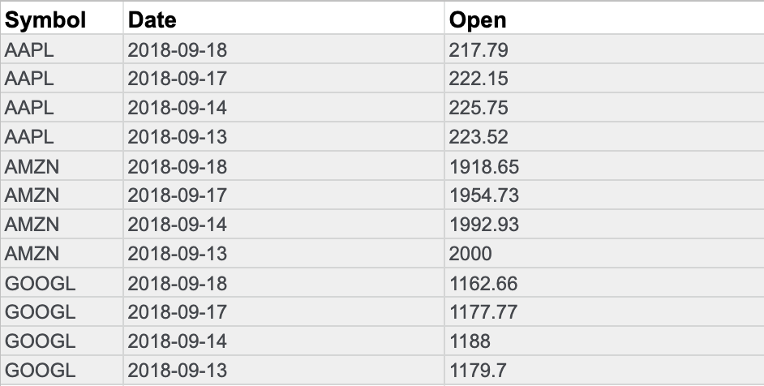
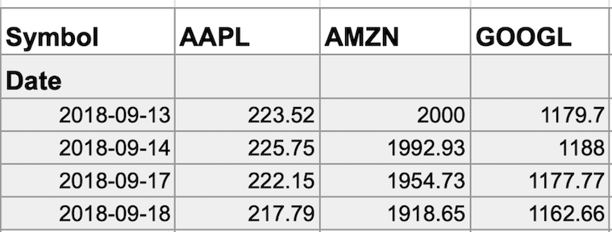

# Explorar tipos de datos, campos y valores

## Conozca el tipo de Datos con los que trabaja
- A estas alturas ya has aprendido mucho sobre los datos.
- ​Desde los datos generados hasta los datos recopilados y los formatos de datos, ​es bueno saber todo lo que pueda ​sobre los datos que utilizará para el análisis.
- ​En este vídeo, hablaremos de otra forma de ​describir los datos: el tipo de datos.
- ​Un tipo de datos es un tipo específico de atributo de datos ​que indica qué tipo de valor son los datos.
- ​En otras palabras, un tipo de datos ​indica con qué tipo de datos está trabajando.
- ​Datos de los tipos de datos pueden ​variar según el lenguaje de consulta que utilices.
- ​Por ejemplo, SQL permite ​diferentes tipos de datos según ​la base de datos que esté utilizando.

- ​Sin embargo, por ahora, centrémonos en ​los tipos de datos que utilizarás en las hojas de cálculo.
- ​Para ayudarnos, utilizaremos ​una hoja de cálculo que ya está llena de datos.
- ​Lo llamaremos « ​Intereses mundiales por los dulces a través de las búsquedas en Google».
- ​Ahora, un tipo de datos en ​una hoja de cálculo puede ser una de estas tres cosas: ​un número, un texto ​o una cadena, o un valor Booleano.
- ​Es posible que encuentres programas de hojas de cálculo que las clasifiquen de forma ​un poco diferente o incluyan otros tipos, ​pero estos tipos de valores cubren casi ​cualquier dato que encuentres en las hojas de cálculo.
- ​Vamos a ver todo esto dentro de un poco.
- ​Al observar las columnas B, D ​y F, encontramos tipos de datos numéricos.

- ​Cada número representa el interés de búsqueda de ​los términos «cupcakes», ​«helados» y «caramelos» para una semana específica.
- ​Cuanto más cerca esté un número de 100, ​más popular fue el término de búsqueda durante esa semana.
- ​Cien representa la máxima popularidad.
- ​Ten en cuenta que, en este caso, ​100 es un valor relativo, ​no el número real de búsquedas.
- ​Representa el número máximo ​de búsquedas durante un tiempo determinado.
- ​Piense en ello como un porcentaje en una prueba.
- ​Todas las demás búsquedas también se valoran sobre 100.

- ​Es posible que también observe esto en otros conjuntos de datos.
- ¡ ​Estrella de oro para 100! ​Si lo necesitabas, puedes cambiar los números a ​porcentajes u otros formatos, como moneda.
- ​Todos estos son ejemplos de tipos de datos numéricos.
- ​En la columna H, los datos muestran ​la golosina más popular de cada semana, ​según los datos de búsqueda.
- ​Como veremos en la celda H4 para ​la semana que comenzó el 28 de julio de 2019, ​la delicia más popular fue el helado.
- ​Este es un ejemplo de un tipo de datos de texto ​o un tipo de datos de cadena, ​que es una secuencia de caracteres y signos de ​puntuación que contiene información textual.

- ​En este ejemplo, esa información ​serían las golosinas y los nombres de las personas.
- ​También pueden incluir números, como ​números de teléfono o números en direcciones postales.
- ​Sin embargo, estos números no se utilizarían para los cálculos.
- ​En este caso, se tratan como texto, no como números.
- ​En las columnas C, E ​y G, parece que tenemos algo de texto.
- ​Sin embargo, el texto aquí no es un tipo de datos de texto o cadena.
- ​En cambio, es un tipo de datos booleanos.

- ​Datos booleanos son tipos de ​datos con solo dos valores posibles: verdadero o falso.
- ​Las columnas C, E y G muestran ​datos booleanos que indican si el ​interés de búsqueda de cada semana ​es de al menos 50 de cada 100.
- ​Así es como funciona.
- Para obtener estos datos, ​hemos creado una fórmula que calcula ​si los datos de interés de búsqueda de las columnas B ​, D y F son 50 o superiores.
- ​En la celda B4, el interés de búsqueda es 14.
- ​En la celda C4, encontramos la palabra falso ​porque, para esta semana de datos, ​el interés de búsqueda es inferior a 50.
- ​Para cada celda de las columnas C, E ​y G, los dos únicos valores posibles son verdadero o falso.

- ​Podríamos cambiar la fórmula para que ​aparezcan otras palabras en estas celdas, ​pero siguen siendo datos booleanos.
- ​Pronto tendrás la oportunidad de leer más ​sobre el tipo de datos booleanos.
- ​Hablemos de un problema común con el que se ​encuentran las personas en las hojas de cálculo: ​confundir los tipos de datos con los valores de las celdas.
- ​Por ejemplo, en la celda B57, ​podemos crear una fórmula para calcular los datos de otras celdas.
- ​Esto nos dará el promedio de los intereses de búsqueda ​en cupcakes en todas las semanas del conjunto de datos, ​que es de aproximadamente 15.
- ​La fórmula funciona porque ​calculamos con un tipo de datos numérico.
- ​Pero si lo probábamos con un tipo de datos de texto o cadena, ​como los datos de la columna C, obtendríamos un error.

- ​Los valores de error suelen producirse si se ​comete un error al introducir los valores en las celdas.
- ​Cuanto más conozca sus tipos de datos y cuáles usar, ​menos errores cometerá.
- ​Ahí lo tienes, un tipo de datos para todos.
- ​Aún no hemos terminado.
- Próximamente, ​profundizaremos en la relación entre los tipos de datos ​, los campos y los valores.
- Nos vemos pronto.

---

## Utilizar la lógica booleana
- En esta lectura, explorará los fundamentos de la lógica booleana y aprenderá a utilizar condiciones simples y múltiples en una expresión booleana.
- Estas condiciones se crean con operadores booleanos, incluyendo AND, OR, y NOT.
- Estos operadores son similares a los operadores matemáticos y pueden utilizarse para crear sentencias lógicas que filtren los resultados.
- Los analistas de datos utilizan sentencias booleanas para realizar una amplia gama de tareas de análisis de datos, como escribir consultas para búsquedas y comprobar condiciones al escribir código de programación.

- Ejemplo de lógica booleana
   - Imagine que está comprando unos zapatos y tiene en cuenta ciertas preferencias:
      - Comprará los zapatos sólo si son una combinación de rosa y gris
      - Comprará los zapatos si son totalmente rosas, totalmente grises o si son rosas y grises
      - Comprará los zapatos si son grises, pero no si son rosas
      - Estos diagramas de Venn ilustran tus preferencias de zapatos.
      - AND es el centro del diagrama de Venn, donde se solapan dos condiciones.
      - OR incluye cualquiera de las condiciones.
      - NOT incluye sólo la parte del diagrama de Venn que no contiene la excepción.  

- Utilizar la lógica booleana en las sentencias
   - En las consultas, la lógica booleana se representa en una sentencia escrita con operadores booleanos.
   - Un operador es un símbolo que nombra la operación o cálculo a realizar.
   - Siga leyendo para descubrir cómo puede convertir sus preferencias en sentencias booleanas.

   - El operador AND
      - Tu condición es "Si el color del zapato tiene cualquier combinación de gris y rosa, los comprarás"
      - La sentencia booleana descompondría la lógica de esa sentencia para filtrar tus resultados por ambos colores.
      - Diría `IF (Color="Grey") AND (Color="Pink") then buy them`
      - El operador AND permite apilar ambas condiciones. 
      - A continuación se muestra una tabla de verdad simple que describe la lógica booleana en el trabajo en esta declaración.
      - En la columna Color es Gris, hay dos pares de zapatos que cumplen la condición de color.
      - Y en la columna Color es Rosa, hay dos pares que cumplen esa condición.
      - Pero en la columna Si Gris Y Rosa, sólo un par de zapatos cumple ambas condiciones.
      - Por lo tanto, según la lógica booleana de la afirmación, sólo hay un par marcado como verdadero.
      - En otras palabras, hay un par de zapatos que compraría.

   | El color es gris | El color es rosa | Si Gris Y Rosa, entonces Comprar | Lógica booleana |
   | ---------------- | ---------------- | -------------------------------- | --------------- |
   | Gris/Verdadero   | Rosa/Verdadero   | Verdadero/Comprar                | Verdadero Y Verdadero = Verdadero |
   | Gris/Verdadero   | Negro/Falso      | Falso/No comprar                 | Verdadero Y Falso = Falso         |
   | Rojo/Falso       | Rosa/Verdadero   | Falso/No comprar                 | Falso Y Verdadero = Falso         |
   | Rojo/Falso       | Verde/Falso      | Falso/No comprar                 | Falso AND Falso = Falso           |

   - El operador OR
      - El operador OR le permite avanzar si se cumple una de sus dos condiciones.
      - Su condición es "Si los zapatos son grises o rosas, los comprará"
      - La expresión booleana sería `IF (Color="Grey") OR (Color="Pink") then buy them`.
      - Observe que cualquier zapato que cumpla la condición Color es gris o Color es rosa es marcado como verdadero por la lógica booleana.
      - Según la tabla de verdad de abajo, hay tres pares de zapatos que puedes comprar.

   | Color es Gris  | El color es rosa  | Si Gris O Rosa, entonces Comprar | Lógica booleana  |
   | -------------- | ----------------- | -------------------------------- | ---------------- |
   | Rojo/Falso     | Negro/Falso       | Falso/No comprar                 | Falso O Falso = Falso |
   | Negro/Falso    | Rosa/Verdadero    | Verdadero/Comprar                | Falso O Verdadero = Verdadero |
   | Gris/Verdadero | Verde/Falso       | Verdadero/Comprar                | Verdadero O Falso = Verdadero |
   | Gris/Verdadero | Rosa/Verdadero    | Verdadero/Comprar                | Verdadero OR Verdadero = Verdadero |

   - El operador NOT
   - Por último, el operador NOT le permite filtrar restando condiciones específicas de los resultados.
   - Tu condición es "Comprarás cualquier zapato gris excepto los que tengan algún rastro de rosa"
   - Su declaración booleana sería `IF (Color="Grey") AND (Color=NOT "Pink") then buy them`
   - Ahora, todos los zapatos grises que no son rosas son marcados como verdaderos por la lógica booleana de la condición NOT Rosa.
   - Los zapatos rosas son marcados como falsos por la lógica booleana de la condición NOT Rosa.
   - Sólo un par de zapatos está excluido en la tabla de verdad de abajo.

   | Color es Gris   | El color es rosa   | Lógica booleana para NOT Pink  | Si Gris AND (NOT Rosa), entonces Compra | Lógica booleana |
   | --------------- | ------------------ | ------------------------------ | --------------------------------------- | --------------- |
   | Gris/Verdadero  | Rojo/Falso         | No Falso = Verdadero           | Verdadero/Comprar                       | Verdadero Y Verdadero = Verdadero |
   | Gris/Verdadero  | Negro/Falso        | No Falso = Verdadero           | Verdadero/Comprar                       | Verdadero Y Verdadero = Verdadero |
   | Gris/Verdadero  | Verde/Falso        | No falso = Verdadero           | Verdadero/Comprar                       | Verdadero Y Verdadero = Verdadero |
   | Gris/Verdadero  | Rosa/Verdadero     | No Verdadero = Falso           | Falso/No comprar                        | Verdadero Y Falso = Falso         |

- El poder de las condiciones múltiples
   - Para los analistas de datos, el verdadero poder de la lógica booleana reside en la posibilidad de combinar varias condiciones en una sola sentencia.
   - Por ejemplo, si desea filtrar los zapatos grises o rosas e impermeables, puede construir una expresión booleana como: "IF ((Color = "Grey") OR (Color = "Pink")) AND (Waterproof="True")
   - Observe que puede utilizar paréntesis para agrupar las condiciones.

- Puntos clave
   - Los operadores son símbolos que designan la operación o el cálculo que se va a realizar.
   - Los operadores AND, OR y NOT pueden utilizarse para escribir expresiones booleanas en lenguajes de programación.
   - Tanto si buscas zapatos nuevos como si aplicas esta lógica a las consultas, la lógica booleana te permite crear múltiples condiciones para filtrar los resultados.
   - Ahora que sabes un poco más sobre la lógica booleana, ¡puedes empezar a utilizarla!

- Recursos para más información
   - Conoce quién fue el pionero de la lógica booleana en este artículo histórico: 
      - [Orígenes del álgebra booleana en la lógica de clases](https://www.cs.nmsu.edu/historical-projects/Projects/25520111217Boole-Venn-Peirce%20Intro%20to%20Boolean%20Algebra%20Project.pdf).
   - Obtenga más información sobre el uso de AND, OR y NOT en los siguientes enlaces consejos para [buscar con operadores booleanos](https://libguides.mit.edu/c.php?g=175963&p=1158594).

---

## Componentes de la tabla de datos
- He aquí un acertijo para usted.
- ​¿Qué tienen en común una lista de reproducción musical, una agenda de calendario y una bandeja de entrada de correo electrónico?
- ​Le daré una pista.
- ​No es una jam session semanal.
- ​La respuesta es que todas están organizadas en tablas.
- ​Vaya y eche un vistazo a la bandeja de entrada de su correo electrónico o a su lista de reproducción favorita, o ​mire la agenda de su calendario.
- ​¡En todos hay tablas! 
​Una tabla de datos, o datos tabulados, tiene una estructura muy simple.
- ​Se organiza en filas y columnas.
- ​Puede llamar a las filas "registros" y a las columnas "campos".
- ​Básicamente significan lo mismo, ​pero registros y campos pueden utilizarse para cualquier tipo de tabla de datos, mientras que filas y ​columnas suelen reservarse para las hojas de cálculo.
- ​Cuando se habla de bases de datos estructuradas, ​la gente que se dedica al análisis de datos suele utilizar "registros" y "campos".
-  ​A veces, un campo también puede referirse a un único dato, ​como el valor de una celda.
- ​En cualquier caso, ​escuchará utilizar ambas versiones de estos términos a lo largo de este programa y de su trabajo.

- ​Volvamos a nuestro ejemplo de lista de reproducción.
- ​Usaremos los nuevos términos que acabamos de introducir.
- ​Así que cada canción es un registro.
- ​Cada registro tiene los mismos campos que los demás registros en el mismo orden.
- ​En otras palabras, la lista de reproducción tiene la misma información sobre cada canción.
- ​Cada característica de la canción, como el título y el artista, es un campo.
- ​Cada campo independiente tiene el mismo tipo de datos, pero ​los distintos campos pueden tener tipos diferentes.

- ​Déjeme que le muestre lo que quiero decir.
- ​Para la lista de canciones, los títulos de las canciones son de tipo texto o cadena, mientras que ​la longitud de la canción podría ser de tipo numérico si la está utilizando para cálculos.
- O ​podría ser un tipo de fecha y hora.
- ​La columna de favoritos es booleana ​ya que tiene dos valores posibles: favorito o no favorito.
- ​Podemos ver las hojas de cálculo del mismo modo.
- ​Los registros de una hoja de cálculo pueden ser sobre todo tipo de cosas: ​clientes, productos, facturas o cualquier otra cosa.
- ​Cada registro tiene varios campos, ​que revelan más información sobre los clientes, productos o facturas.

- ​El valor de cada celda contiene un dato específico, ​como la dirección de un cliente o el importe en dólares de una factura.
- ​Como Analista de datos, le llegarán muchos datos, y los registros, campos y ​valores de las tablas de datos le ayudarán a navegar por el análisis.
- ​Comprender las estructuras de las tablas con las que trabaja forma parte de ello.
- ​Y con suerte, mientras trabaja duro en sus análisis y ​en esas tablas, podrá divertirse un poco con una tabla de datos diferente: ​¡la de su lista de reproducción favorita! 

---

## Paso a paso: Conozca los datos anchos y largos
- Esta lectura resume los pasos que el instructor realiza en el siguiente video, Conocer datos anchos y largos.
- En este video, el instructor presenta formatos de datos anchos y largos y discute los tipos de preguntas que cada formato puede ayudarle a responder.
- Mantenga esta guía abierta mientras ve el video.
- Puede servirte como referencia útil si necesitas contexto adicional o aclaración mientras sigues los pasos del video.
- No se trata de una actividad puntuable, pero puedes completar estos pasos para practicar las habilidades demostradas en el vídeo.

- Lo que necesita
   - Si deseas acceder a las hojas de cálculo que el instructor utiliza en este vídeo, selecciona el enlace a un Conjunto de datos para crear una copia.
   - Si no tienes una cuenta de Google, descarga los datos directamente de los archivos adjuntos que aparecen a continuación.
   - Enlace a los conjuntos de datos de Población:
      - [Population-Latin-and-Caribbean-Countries-2010-2019-wide-format.xlsx](./resources/modulo-01/Population-Latin-and-Caribbean-Countries-2010-2019-wide-format.xlsx)
      - [Population-Latin-and-Caribbean-Countries-2010-2019-long-format-.xlsx](./resources/modulo-01/Population-Latin-and-Caribbean-Countries-2010-2019-long-format-.xlsx)

- Ejemplo 1: Examinar Datos en formato ancho
   - Datos en formato ancho es un conjunto de datos en el que cada sujeto de datos tiene una única fila con múltiples columnas para contener los valores de varios atributos del sujeto.
   - Resulta útil para comparar atributos específicos de distintos sujetos.
      - Abra la hoja de cálculo de formato ancho Población, países de América Latina y el Caribe, 2010-2019.
      - Cada fila contiene todos los datos de Población de un país. 
      - Los datos de Población de cada año están contenidos en una columna.
      - Encuentra la población anual de Argentina en la fila 3.
      - En este formato amplio, puede comparar rápidamente la población anual de Argentina con las poblaciones anuales de Antigua y Barbuda, Aruba, Bahamas o cualquier otro país. 
   - Encontrar el país con mayor población en 2010
      - Seleccionar la columna E, que contiene los datos de población de cada país en 2010.
      - Haga clic con el botón derecho del ratón en el Encabezado de la columna E y elija Ordenar de Z a A. 
      - Observa que Brasil encabeza ahora la Lista porque tuvo la mayor población en el año 2010.
   - Encuentra el país con menor población en 2013
      - Seleccionar la columna H. 
      - Clic con el botón derecho del ratón en el Encabezado de columna H y selecciona Ordenar de A a Z. 
      - Observa que las Islas Vírgenes Británicas están ahora en la parte superior porque tenían la población más baja de todos los países en 2013.

- Ejemplo 2: Examinar datos en formato largo
   - Datos en formato largo son datos en los que cada fila representa una observación por sujeto, por lo que cada sujeto estará representado por varias filas.
   - Este formato de datos es útil para comparar cambios a lo largo del tiempo o hacer otras comparaciones entre sujetos.
      - Abra la hoja de cálculo Población, países de América Latina y el Caribe, 2010-2019, formato largo.
      - Observe que los Datos ya no están organizados en columnas por año. Todos los años están ahora en una sola columna.
      - Encuentra los datos de Población de Argentina en las filas 12-21. Cada fila contiene un año de datos de Población de Argentina. 

---

## Conocer datos amplios y largos
- Probablemente utilice las palabras "ancho" y "largo" todo el tiempo.
- ​Puede que utilice "ancho" para describir el tamaño de algo de lado a lado, como ​un río ancho.
- ​Pero un río también puede recorrer grandes distancias, ​así que también podría llamarlo "largo".
- ​¡Espere! Antes de que detenga el vídeo, ​le prometo que no ha hecho clic accidentalmente en el curso equivocado.
- ​No estoy aquí para enseñarle palabras que ya conoce.
- Pero las palabras "ancho" y ​"largo" también pueden utilizarse para describir datos.

- ​Así que estoy aquí para ayudarle a entender los datos anchos y los datos largos.
- ​Hasta ahora ha tratado con datos dispuestos en su mayoría en un formato ancho.
- ​Con los datos anchos, cada sujeto de datos tiene una única fila con múltiples columnas para contener ​los valores de varios atributos del sujeto.
- ​Aquí tiene algunos datos en formato ancho en una hoja de cálculo.
- ​Recordará que antes hablamos de estos datos sobre la población de los países latinos y ​del Caribe.
- ​En este conjunto de datos, cada fila proporciona toda la información sobre la población de un ​país.
- Cada columna muestra la población de un año diferente.

- ​Los datos en formato ancho le permiten identificar fácilmente y comparar rápidamente las diferentes columnas.
- ​En nuestro ejemplo, los datos están ordenados alfabéticamente por país, por lo que ​puede comparar las poblaciones anuales de Antigua y Barbuda, Aruba y ​las Bahamas con sólo comprobar los valores de cada columna.
- ​El formato de datos amplio también facilita encontrar y ​comparar las poblaciones de los países en diferentes periodos de tiempo.
- ​Por ejemplo, ordenando los datos, ​descubrimos que Brasil tenía la población más alta de todos los países en 2010, y ​las Islas Vírgenes Británicas tenían la población más baja de todos los países en 2013.
- ​Bien, ahora exploremos estos datos en formato largo.
- ​Aquí los datos ya no están organizados en columnas por año.
- ​Todos los años están ahora en una columna y cada país, como Argentina, aparece en ​múltiples filas, una por cada año de datos.

- ​Así es como suelen verse los datos en formato largo.
- ​Los datos en formato largo son datos en los que cada fila es un punto temporal por sujeto, por lo que ​cada sujeto tendrá datos en múltiples filas.
- ​Nuestra hoja de cálculo está formateada para mostrar cada año de datos de población.
- ​Aquí vemos primero Antigua y Barbuda.
- ​Los datos largos son un formato estupendo para almacenar y organizar datos cuando hay múltiples ​variables para cada sujeto en cada punto temporal que queremos observar.
- ​Con este formato de datos largos, podemos almacenar y ​analizar todos estos datos utilizando menos columnas.
- Además, si añadimos una nueva variable, ​como la edad media de una población, sólo necesitaríamos una columna más.

- ​Si en lugar de eso hubiéramos utilizado un formato de datos ancho, habríamos necesitado 10 columnas más, una para ​cada año.
- ​El formato de datos largo mantiene todo bonito y compacto.
- ​Si se pregunta qué formato debe utilizar, ​la respuesta es sencilla: "depende".
- ​A veces tendrá que transformar datos anchos en un formato de datos largos, u ​otras veces viceversa.
- ​Probablemente trabajará con ambos formatos en su trabajo.
- Y ​seguro que volverá sobre ambos formatos más adelante en este Programa.
- ​Eso me recuerda que antes definimos los datos como una colección de hechos.

- ​Como ha descubierto en los últimos vídeos, esa colección de hechos puede adoptar ​montones de formatos, estructuras, tipos y mucho más.
- ​Aprender todas las formas en que se pueden presentar los datos le será de gran ayuda ​a lo largo del proceso de análisis de datos.
- ​Cuanto más trabaje con datos en todas sus formas, ​más rápido empezará a reconocer qué datos utilizar y cuándo utilizarlos.
- ​Y dentro de poco, ​utilizará todos esos datos almacenados en su cerebro para ayudarle a realizar una evaluación.
- ​Después, aprenderá a identificar y evitar sesgos en los datos y ​a adoptar la credibilidad, la integridad y la ética.
- ​La aventura de los datos sigue adelante.
- ¡Me alegro de que avance con ella!

---

## Transformación de datos
- ¿Qué es la transformación de datos?
   - En esta lectura, explorará cómo se transforman los datos y las diferencias entre datos anchos y largos.
   - La transformación de datos es el proceso de cambiar el formato, la estructura o los valores de los datos.
   - Como Analista de datos, es muy probable que necesite transformar los datos en algún momento para que le resulte más fácil analizarlos.
   - La Transformación de datos suele implicar:
      - Añadir, copiar o replicar datos
      - Eliminar campos o registros
      - Normalizar los nombres de las variables
      - Renombrar, mover o combinar columnas en una base de datos
      - Unir un conjunto de datos con otro
      - Guardar un archivo en un formato diferente. Por ejemplo, guardar una hoja de cálculo como un Archivo CSV (valores separados por coma).

- ¿Por qué transformar datos?
   - Los objetivos de la transformación de datos pueden ser:
      - Organización de los datos: unos datos mejor organizados son más fáciles de utilizar
      - Compatibilidad de datos: diferentes aplicaciones o sistemas pueden utilizar entonces los mismos datos
      - Migración de datos: los datos con formatos coincidentes pueden trasladarse de un sistema a otro
      - Fusión de datos: se pueden fusionar datos con la misma organización
      - Mejora de datos: los datos pueden mostrarse con campos más detallados.
      - Comparación de datos: se pueden comparar los datos entre sí.

- Ejemplo de transformación de datos: fusión de datos
   - Mario es un fontanero propietario de una empresa de fontanería.
   - Tras años en el negocio, compra otra empresa de fontanería.
   - Mario quiere fusionar la información de los clientes de la empresa recién adquirida con la suya, pero la otra empresa utiliza una base de datos diferente.
   - Por lo tanto, Mario necesita hacer que los datos sean compatibles.
   - Para ello, tiene que transformar el formato de los datos de la empresa adquirida.
   - Después, debe eliminar las filas duplicadas de los clientes que tenían en común.
   - Cuando los Datos sean compatibles y estén juntos, la empresa de fontanería de Mario tendrá una base de datos de clientes completa y fusionada.

- Ejemplo de transformación de datos: organización de datos (de largo a ancho)
   - Para facilitar la creación de gráficos, puede que también necesite transformar datos largos en datos anchos.
   - Considere el siguiente ejemplo de transformación de cotizaciones bursátiles (recogidas como datos largos) en datos anchos. 
   - Datos en formato largo son aquellos en los que cada fila contiene un único punto de datos para un elemento concreto.
   - En el siguiente ejemplo de datos en formato largo, se han recopilado las cotizaciones bursátiles individuales (puntos de datos) de Apple (AAPL), Amazon (AMZN) y Google (GOOGL) (elementos concretos) en las fechas indicadas.
   - Ejemplo de datos en formato largo: Precios de las acciones
      - Datos en formato ancho son aquellos en los que cada fila contiene múltiples puntos de datos para los artículos particulares identificados en las columnas.
   

   - Ejemplo de datos en formato ancho: Precios de las acciones
      
      

      - Con los datos transformados en datos anchos, puede crear un gráfico en el que se compare la evolución de las acciones de cada empresa durante el mismo periodo de tiempo.  
      - Puede observar que todos los datos incluidos en el formato largo también están en el formato ancho.
      - Pero los Datos en formato ancho son más fáciles de leer y comprender.
      - Por eso, los analistas de datos suelen transformar los datos largos en datos anchos con más frecuencia de lo que transforman los datos anchos en datos largos.
      - La siguiente tabla resume cuándo se prefiere cada formato:

      | Datos en formato ancho se prefieren cuando | Datos en formato largo se prefieren cuando |
      | ------------------------------------------ | ------------------------------------------ |
      | Creación de tablas y gráficos con unas pocas variables sobre cada sujeto | Almacenamiento de muchas variables sobre cada sujeto. Por ejemplo, 60 años de tipos de interés de cada banco |
      | Comparar gráficos de líneas sencillos | Realizar análisis estadísticos o gráficos avanzados |

---

## Actividad práctica: Introducción a Kaggle
- Resumen de actividades
   - A estas alturas, ya habrá aprendido mucho sobre los diferentes tipos y estructuras de datos.
   - En esta actividad, trabajará con conjuntos de datos de Kaggle, una comunidad en línea de personas apasionadas por los datos.
   - Para comenzar esta actividad, creará una cuenta de Kaggle, configurará un perfil y explorará los cuadernos de Kaggle.
   - Todo analista de datos tiene una comunidad de datos en la que confía para obtener ayuda, apoyo e inspiración.
   - Kaggle puede ayudarle a construir su propia comunidad de datos.
   - Kaggle tiene millones de usuarios en todas las etapas de su carrera de datos, desde principiantes hasta científicos de datos con décadas de experiencia.
   - La comunidad Kaggle reúne a personas para desarrollar sus habilidades de análisis de datos, compartir conjuntos de datos y cuadernos interactivos, y colaborar en la resolución de problemas de datos de la vida real.
   - Eche un vistazo a este [breve vídeo introductorio](https://www.youtube.com/watch?v=TNzDMOg_zsw) para saber más sobre Kaggle.
   - Cuando complete esta actividad, será capaz de utilizar muchas de las características clave de Kaggle.
   - Esto le permitirá crear cuadernos y navegar por los datos, lo cual es importante para completar y compartir proyectos de datos en su carrera como analista de datos.

- Instrucciones paso a paso
   - Siga las instrucciones para completar cada paso de la actividad.
   - A continuación, responda a las preguntas al final de la actividad antes de pasar al siguiente punto del curso.

1. Crear una cuenta en Kaggle
   - Para empezar, siga estos pasos para crear una cuenta en Kaggle. 
   - Nota: Kaggle actualiza con frecuencia su interfaz de usuario. Es posible que los últimos cambios no se reflejen en las capturas de pantalla, pero los principios de esta actividad siguen siendo los mismos. Adaptarse a los cambios en las actualizaciones del software es una habilidad esencial para los analistas de datos, y le animamos a que practique la resolución de problemas. También puede pedir ayuda a su comunidad de alumnos en el foro de debate.
   - Ir a [kaggle.com](http://www.kaggle.com/)
   - Haga clic en el botón Registrarse situado en la parte superior derecha de la página de inicio de Kaggle.
   - Puede registrarse con sus credenciales de Google o con su dirección de correo electrónico personal.
   - Una vez que se haya registrado y haya iniciado sesión en Kaggle, haga clic en el icono Cuenta situado en la parte superior derecha de la pantalla.
   - En el menú que se abre, haga clic en el botón Su perfil. 
   - En la página de su perfil, haga clic en el botón Editar perfil.
   - Introduzca cualquier información que desee compartir con la comunidad de Kaggle.
   - Su perfil será público, así que introduzca sólo la información que se sienta cómodo compartiendo
   - Si quiere un poco de inspiración, ¡eche un vistazo al perfil del [Defensor de la Comunidad de Kaggle, Jesse Mostipak](https://www.kaggle.com/jessemostipak)

2. Vaya a la página de inicio de código
   - Ahora que ha creado una cuenta y configurado su perfil, puede consultar algunos cuadernos en Kaggle.
   - Los Kagglers utilizan cuadernos para compartir conjuntos de datos y análisis de datos.
   - En primer lugar, vaya a la barra de navegación en la parte izquierda de su pantalla.
   - A continuación, haga clic en el icono Código.
   - Esto le llevará a la página de inicio de Código. 

3. Revisar las contribuciones de Kaggler
   - En la página de inicio de Código, encontrará enlaces a cuadernos creados por otros Kagglers.
   - Para empezar, desplácese por la Lista y haga clic en los Notebooks que le interesen.
   - A medida que explore, es posible que se encuentre con términos desconocidos e información nueva: ¡No pasa nada! Los Kagglers proceden de diversos entornos y se centran en diferentes áreas del análisis de datos, la Ciencia de datos, el aprendizaje automático y el aprendizaje profundo.

4. Limite su búsqueda
   - Una vez que se haya familiarizado con la página de inicio de Código, puede limitar los resultados de su búsqueda escribiendo una palabra en la barra de búsqueda o utilizando la función de filtro.
   - Por ejemplo, introduzca Principiante en la barra de búsqueda para mostrar cuadernos etiquetados como aptos para principiantes.
   - O bien, haga clic en el icono Filtro , la forma de triángulo situada a la derecha de la barra de búsqueda.
   - Puede filtrar los resultados por etiquetas, lenguaje de programación, salida y otras opciones.
   - Filtre a Conjuntos de datos para mostrar cuadernos que utilicen uno de las decenas de miles de conjuntos de datos públicos disponibles en Kaggle.

5. Revisar los notebooks sugeridos
   - Dedica algún tiempo a explorar un par de cuadernos que aparezcan en los resultados de tu búsqueda.
   - Esto te ayudará a familiarizarte con el trabajo que los Kagglers comparten en línea y que podrás crear cuando hayas terminado este curso

6. Editar un notebook
   - Ahora, trabaja con un cuaderno específico: [Análisis de los aldeanos de Animal Crossing](https://www.kaggle.com/code/jessemostipak/animal-crossing-villager-analysis)
 por Jesse Mostipak.
   - Este cuaderno incluye el análisis de los personajes aldeanos del videojuego Animal Crossing.
   - Sigue estos pasos para aprender a editar cuadernos:
      1. Haz clic en el enlace para abrir el cuaderno. Contiene el conjunto de datos con el que trabajarás más adelante.
      2. Haz clic en el botón Copiar y editar de la parte superior derecha para hacer una copia de la libreta en tu cuenta. Ahora, el cuaderno aparece en modo Editar . El modo Edición le permite realizar cambios en la libreta si lo desea.
         - Esta libreta es privada.
         - Si quieres compartir tu trabajo, puedes hacerla pública.
         - Cuando copies y edites el trabajo de otro Kaggler, haz siempre cambios significativos en el cuaderno antes de publicarlo.
         - De esta forma, no estarás tergiversando el trabajo de otra persona como si fuera tuyo.
      3. Tómate un momento para explorar el modo Editar del cuaderno.
         - Algunos de los contenidos del cuaderno, incluyendo el código Python, pueden parecerte poco familiares, y eso está bien.
         - Al final de este curso, sabrás cómo crear un cuaderno como éste desde cero 

7. Trabajar con conjuntos de datos en notebooks
   - Ahora ya puedes consultar los datos
   - En este cuaderno, encontrarás los datos en un recuadro llamado Conjuntos de datos en la parte superior derecha de la pantalla.
   - En el cuadro, hay una carpeta de entrada con el título: animal-crossing-new-horizons-nookplaza.
   - Sigue estas instrucciones para explorar los conjuntos de datos y aprender más sobre los datos que contienen:
      - Haga clic en este título. Aparecerá una lista de archivos .csv en orden alfabético. Haga clic en el archivo villagers.csv. Este archivo incluye datos sobre los distintos atributos de cada personaje aldeano del videojuego. En la parte inferior del cuaderno, encontrarás ahora una tabla de datos interactiva con toda la información del conjunto de datos. 
      - Tómate un momento para explorar el conjunto de datos.
      - Ordena los datos de cada columna haciendo clic en las barras horizontales situadas a la derecha del nombre de cada columna.
      - Haz clic en el botón que dice 10 de 17 columnas para cambiar las columnas visibles en la tabla.
         - En el menú desplegable, hay una marca de verificación junto al nombre de cada columna que aparece en la tabla. Marcar o desmarcar una de estas casillas cambiará los datos que se presentan.
         - Enhorabuena Ha explorado varias formas de interactuar con el conjunto de datos. Esto te ayudará a familiarizarte con la interfaz de Kaggle. Puedes guardar el cuaderno en el que has trabajado para futuras consultas. Próximamente, aprenderás más sobre otras formas de utilizar Kaggle.

- Reflexión

1. ¿Qué afirmaciones son ciertas sobre el conjunto de datos de aldeanos del cuaderno Análisis de aldeanos de Animal Crossing? Selecciona todas las que correspondan
   - [ ] en aldeanos.csv, la columna Frase Clave no se puede ordenar.
   - [x] en villagers.csv, la columna Nombre incluye dos nombres que empiezan por la letra "Z" (Zell y Zucker). 
   - [x] aldeanos.csv tiene 17 columnas.
   - [ ] aldeanos.csv incluye una columna llamada Tamaño.
> El archivo villagers. csv tiene 17 columnas. En aldeanos.csv, la columna Nombre incluye dos nombres que empiezan por la letra "Z" (Zell y Zucker). Para conocer el conjunto de datos aldeanos, has utilizado la función de visualización de datos de un cuaderno interactivo. En adelante, podrás utilizar cuadernos interactivos para examinar y describir datos. Se trata de una habilidad importante que te ayudará a completar proyectos de datos en el futuro.

2. En esta actividad, has aprendido mucho sobre tipos y estructuras de datos. Utilizando lo que has aprendido hasta ahora, considera tu experiencia con los conjuntos de datos en general y con el conjunto de datos de los aldeanos en particular. En el cuadro de texto que aparece a continuación, escribe de 2 a 3 frases (de 40 a 60 palabras) en respuesta a cada una de las siguientes preguntas:
   - Utilizando toda la información que has aprendido mientras explorabas en Kaggle, ¿cómo describirías a fondo este conjunto de datos a otra persona?
   - ¿Cómo crees que compartir cuadernos interactivos en línea puede ayudarte a desarrollar tus habilidades de análisis de datos? 

- ¿cómo describirías a fondo este conjunto de datos a otra persona?
> Sobre el archivo y datos concretos de villagers.csv lo describiría como un conjunto de datos sobre las características de los aldeanos del juego Animal Crossing, donde podemos apreciar tanto su género, personalidad, fecha de cumpleaños y otros detalles que nos permiten saber cómo interactuar mejor con ellos.

- ¿Cómo crees que compartir cuadernos interactivos en línea puede ayudarte a desarrollar tus habilidades de análisis de datos?
> Compartir datos de esta forma es muy útil porque permite que otras personas con más experiencia puedan aportar comentarios e indicaciones para mejorar la forma en que se recolecta, presentan e incluso sobre la visión que hay del resultado presentado, además al publicar uno mismo se pone más observador con el trabajo propio.

- Comentarios 
> ¡Enhorabuena por completar esta actividad práctica! Has trabajado con cuadernos y has explorado un conjunto de datos en Kaggle. Una buena respuesta sería que los recursos en línea como Kaggle ayudan a los analistas de datos a realizar muchas tareas importantes. Más allá de eso, considera lo siguiente:
> Los analistas de datos utilizan una variedad de recursos para completar proyectos de análisis de datos. Por ejemplo, un analista podría utilizar cuadernos de Kaggle para alojar proyectos en una cartera. Esto es importante para practicar y demostrar sus habilidades, así como para obtener comentarios de analistas de datos más experimentados sobre su trabajo.

---

## Pon a prueba tus conocimientos sobre tipos de datos, campos y valores

1. Rellene el espacio en blanco: Un tipo de datos es una clase específica de datos _____ que indica qué clase de valor son los datos. 
   - [x] atributo
   - [ ] marco
   - [ ] Modelo
   - [ ] punto
> Un tipo de datos es un tipo específico de atributo de datos que indica qué tipo de valor son los datos. 

2. ¿Cuáles son las características clave de un tipo de datos de texto, o Cadena? Seleccione todas las que correspondan.
   - [x] Contiene información textual
   - [x] Secuencia de caracteres y puntuación
   - [ ] Tiene porcentajes numéricos
   - [ ] Sólo dos valores posibles
> Los Tipos de datos de texto, o Cadena, son secuencias de caracteres y signos de puntuación que contienen información textual.

3. En una tabla de Datos, ¿dónde están contenidos los campos?
   - [ ] Favoritos
   - [ ] Filas
   - [x] Columnas
   - [ ] Gráficos
> En una tabla de Datos, las columnas son campos y las filas son registros.

4. Cuando se utilizan datos largos, cada sujeto tiene datos en varias filas. Esto se debe a que cada fila representa ¿qué? 
   - [ ] Datos en diferentes formatos
   - [ ] Puntos de datos verdaderos o falsos
   - [ ] Valores múltiples 
   - [x] Una observación por sujeto
> Cuando se utilizan datos largos, cada sujeto tiene datos en varias filas. Esto se debe a que cada fila representa un punto de observación por sujeto.