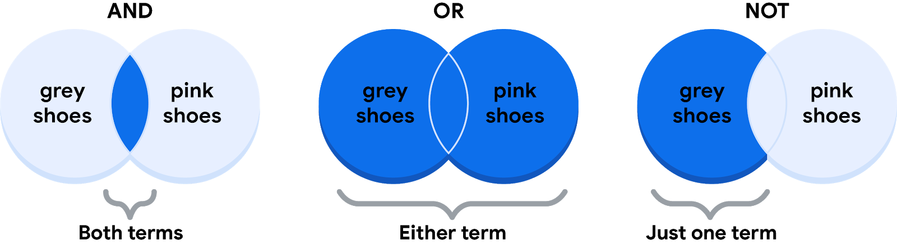

# Explorar tipos de datos, campos y valores

## Conozca el tipo de Datos con los que trabaja
- A estas alturas ya has aprendido mucho sobre los datos.
- ​Desde los datos generados hasta los datos recopilados y los formatos de datos, ​es bueno saber todo lo que pueda ​sobre los datos que utilizará para el análisis.
- ​En este vídeo, hablaremos de otra forma de ​describir los datos: el tipo de datos.
- ​Un tipo de datos es un tipo específico de atributo de datos ​que indica qué tipo de valor son los datos.
- ​En otras palabras, un tipo de datos ​indica con qué tipo de datos está trabajando.
- ​Datos de los tipos de datos pueden ​variar según el lenguaje de consulta que utilices.
- ​Por ejemplo, SQL permite ​diferentes tipos de datos según ​la base de datos que esté utilizando.

- ​Sin embargo, por ahora, centrémonos en ​los tipos de datos que utilizarás en las hojas de cálculo.
- ​Para ayudarnos, utilizaremos ​una hoja de cálculo que ya está llena de datos.
- ​Lo llamaremos « ​Intereses mundiales por los dulces a través de las búsquedas en Google».
- ​Ahora, un tipo de datos en ​una hoja de cálculo puede ser una de estas tres cosas: ​un número, un texto ​o una cadena, o un valor Booleano.
- ​Es posible que encuentres programas de hojas de cálculo que las clasifiquen de forma ​un poco diferente o incluyan otros tipos, ​pero estos tipos de valores cubren casi ​cualquier dato que encuentres en las hojas de cálculo.
- ​Vamos a ver todo esto dentro de un poco.
- ​Al observar las columnas B, D ​y F, encontramos tipos de datos numéricos.

- ​Cada número representa el interés de búsqueda de ​los términos «cupcakes», ​«helados» y «caramelos» para una semana específica.
- ​Cuanto más cerca esté un número de 100, ​más popular fue el término de búsqueda durante esa semana.
- ​Cien representa la máxima popularidad.
- ​Ten en cuenta que, en este caso, ​100 es un valor relativo, ​no el número real de búsquedas.
- ​Representa el número máximo ​de búsquedas durante un tiempo determinado.
- ​Piense en ello como un porcentaje en una prueba.
- ​Todas las demás búsquedas también se valoran sobre 100.

- ​Es posible que también observe esto en otros conjuntos de datos.
- ¡ ​Estrella de oro para 100! ​Si lo necesitabas, puedes cambiar los números a ​porcentajes u otros formatos, como moneda.
- ​Todos estos son ejemplos de tipos de datos numéricos.
- ​En la columna H, los datos muestran ​la golosina más popular de cada semana, ​según los datos de búsqueda.
- ​Como veremos en la celda H4 para ​la semana que comenzó el 28 de julio de 2019, ​la delicia más popular fue el helado.
- ​Este es un ejemplo de un tipo de datos de texto ​o un tipo de datos de cadena, ​que es una secuencia de caracteres y signos de ​puntuación que contiene información textual.

- ​En este ejemplo, esa información ​serían las golosinas y los nombres de las personas.
- ​También pueden incluir números, como ​números de teléfono o números en direcciones postales.
- ​Sin embargo, estos números no se utilizarían para los cálculos.
- ​En este caso, se tratan como texto, no como números.
- ​En las columnas C, E ​y G, parece que tenemos algo de texto.
- ​Sin embargo, el texto aquí no es un tipo de datos de texto o cadena.
- ​En cambio, es un tipo de datos booleanos.

- ​Datos booleanos son tipos de ​datos con solo dos valores posibles: verdadero o falso.
- ​Las columnas C, E y G muestran ​datos booleanos que indican si el ​interés de búsqueda de cada semana ​es de al menos 50 de cada 100.
- ​Así es como funciona.
- Para obtener estos datos, ​hemos creado una fórmula que calcula ​si los datos de interés de búsqueda de las columnas B ​, D y F son 50 o superiores.
- ​En la celda B4, el interés de búsqueda es 14.
- ​En la celda C4, encontramos la palabra falso ​porque, para esta semana de datos, ​el interés de búsqueda es inferior a 50.
- ​Para cada celda de las columnas C, E ​y G, los dos únicos valores posibles son verdadero o falso.

- ​Podríamos cambiar la fórmula para que ​aparezcan otras palabras en estas celdas, ​pero siguen siendo datos booleanos.
- ​Pronto tendrás la oportunidad de leer más ​sobre el tipo de datos booleanos.
- ​Hablemos de un problema común con el que se ​encuentran las personas en las hojas de cálculo: ​confundir los tipos de datos con los valores de las celdas.
- ​Por ejemplo, en la celda B57, ​podemos crear una fórmula para calcular los datos de otras celdas.
- ​Esto nos dará el promedio de los intereses de búsqueda ​en cupcakes en todas las semanas del conjunto de datos, ​que es de aproximadamente 15.
- ​La fórmula funciona porque ​calculamos con un tipo de datos numérico.
- ​Pero si lo probábamos con un tipo de datos de texto o cadena, ​como los datos de la columna C, obtendríamos un error.

- ​Los valores de error suelen producirse si se ​comete un error al introducir los valores en las celdas.
- ​Cuanto más conozca sus tipos de datos y cuáles usar, ​menos errores cometerá.
- ​Ahí lo tienes, un tipo de datos para todos.
- ​Aún no hemos terminado.
- Próximamente, ​profundizaremos en la relación entre los tipos de datos ​, los campos y los valores.
- Nos vemos pronto.

---

## Utilizar la lógica booleana
- En esta lectura, explorará los fundamentos de la lógica booleana y aprenderá a utilizar condiciones simples y múltiples en una expresión booleana.
- Estas condiciones se crean con operadores booleanos, incluyendo AND, OR, y NOT.
- Estos operadores son similares a los operadores matemáticos y pueden utilizarse para crear sentencias lógicas que filtren los resultados.
- Los analistas de datos utilizan sentencias booleanas para realizar una amplia gama de tareas de análisis de datos, como escribir consultas para búsquedas y comprobar condiciones al escribir código de programación.

- Ejemplo de lógica booleana
   - Imagine que está comprando unos zapatos y tiene en cuenta ciertas preferencias:
      - Comprará los zapatos sólo si son una combinación de rosa y gris
      - Comprará los zapatos si son totalmente rosas, totalmente grises o si son rosas y grises
      - Comprará los zapatos si son grises, pero no si son rosas
      - Estos diagramas de Venn ilustran tus preferencias de zapatos.
      - AND es el centro del diagrama de Venn, donde se solapan dos condiciones.
      - OR incluye cualquiera de las condiciones.
      - NOT incluye sólo la parte del diagrama de Venn que no contiene la excepción.  

- Utilizar la lógica booleana en las sentencias
   - En las consultas, la lógica booleana se representa en una sentencia escrita con operadores booleanos.
   - Un operador es un símbolo que nombra la operación o cálculo a realizar.
   - Siga leyendo para descubrir cómo puede convertir sus preferencias en sentencias booleanas.

   - El operador AND
      - Tu condición es "Si el color del zapato tiene cualquier combinación de gris y rosa, los comprarás"
      - La sentencia booleana descompondría la lógica de esa sentencia para filtrar tus resultados por ambos colores.
      - Diría `IF (Color="Grey") AND (Color="Pink") then buy them`
      - El operador AND permite apilar ambas condiciones. 
      - A continuación se muestra una tabla de verdad simple que describe la lógica booleana en el trabajo en esta declaración.
      - En la columna Color es Gris, hay dos pares de zapatos que cumplen la condición de color.
      - Y en la columna Color es Rosa, hay dos pares que cumplen esa condición.
      - Pero en la columna Si Gris Y Rosa, sólo un par de zapatos cumple ambas condiciones.
      - Por lo tanto, según la lógica booleana de la afirmación, sólo hay un par marcado como verdadero.
      - En otras palabras, hay un par de zapatos que compraría.

   | El color es gris | El color es rosa | Si Gris Y Rosa, entonces Comprar | Lógica booleana |
   | ---------------- | ---------------- | -------------------------------- | --------------- |
   | Gris/Verdadero   | Rosa/Verdadero   | Verdadero/Comprar                | Verdadero Y Verdadero = Verdadero |
   | Gris/Verdadero   | Negro/Falso      | Falso/No comprar                 | Verdadero Y Falso = Falso         |
   | Rojo/Falso       | Rosa/Verdadero   | Falso/No comprar                 | Falso Y Verdadero = Falso         |
   | Rojo/Falso       | Verde/Falso      | Falso/No comprar                 | Falso AND Falso = Falso           |

   - El operador OR
      - El operador OR le permite avanzar si se cumple una de sus dos condiciones.
      - Su condición es "Si los zapatos son grises o rosas, los comprará"
      - La expresión booleana sería `IF (Color="Grey") OR (Color="Pink") then buy them`.
      - Observe que cualquier zapato que cumpla la condición Color es gris o Color es rosa es marcado como verdadero por la lógica booleana.
      - Según la tabla de verdad de abajo, hay tres pares de zapatos que puedes comprar.

   | Color es Gris  | El color es rosa  | Si Gris O Rosa, entonces Comprar | Lógica booleana  |
   | -------------- | ----------------- | -------------------------------- | ---------------- |
   | Rojo/Falso     | Negro/Falso       | Falso/No comprar                 | Falso O Falso = Falso |
   | Negro/Falso    | Rosa/Verdadero    | Verdadero/Comprar                | Falso O Verdadero = Verdadero |
   | Gris/Verdadero | Verde/Falso       | Verdadero/Comprar                | Verdadero O Falso = Verdadero |
   | Gris/Verdadero | Rosa/Verdadero    | Verdadero/Comprar                | Verdadero OR Verdadero = Verdadero |

   - El operador NOT
   - Por último, el operador NOT le permite filtrar restando condiciones específicas de los resultados.
   - Tu condición es "Comprarás cualquier zapato gris excepto los que tengan algún rastro de rosa"
   - Su declaración booleana sería `IF (Color="Grey") AND (Color=NOT "Pink") then buy them`
   - Ahora, todos los zapatos grises que no son rosas son marcados como verdaderos por la lógica booleana de la condición NOT Rosa.
   - Los zapatos rosas son marcados como falsos por la lógica booleana de la condición NOT Rosa.
   - Sólo un par de zapatos está excluido en la tabla de verdad de abajo.

   | Color es Gris   | El color es rosa   | Lógica booleana para NOT Pink  | Si Gris AND (NOT Rosa), entonces Compra | Lógica booleana |
   | --------------- | ------------------ | ------------------------------ | --------------------------------------- | --------------- |
   | Gris/Verdadero  | Rojo/Falso         | No Falso = Verdadero           | Verdadero/Comprar                       | Verdadero Y Verdadero = Verdadero |
   | Gris/Verdadero  | Negro/Falso        | No Falso = Verdadero           | Verdadero/Comprar                       | Verdadero Y Verdadero = Verdadero |
   | Gris/Verdadero  | Verde/Falso        | No falso = Verdadero           | Verdadero/Comprar                       | Verdadero Y Verdadero = Verdadero |
   | Gris/Verdadero  | Rosa/Verdadero     | No Verdadero = Falso           | Falso/No comprar                        | Verdadero Y Falso = Falso         |

- El poder de las condiciones múltiples
   - Para los analistas de datos, el verdadero poder de la lógica booleana reside en la posibilidad de combinar varias condiciones en una sola sentencia.
   - Por ejemplo, si desea filtrar los zapatos grises o rosas e impermeables, puede construir una expresión booleana como: "IF ((Color = "Grey") OR (Color = "Pink")) AND (Waterproof="True")
   - Observe que puede utilizar paréntesis para agrupar las condiciones.

- Puntos clave
   - Los operadores son símbolos que designan la operación o el cálculo que se va a realizar.
   - Los operadores AND, OR y NOT pueden utilizarse para escribir expresiones booleanas en lenguajes de programación.
   - Tanto si buscas zapatos nuevos como si aplicas esta lógica a las consultas, la lógica booleana te permite crear múltiples condiciones para filtrar los resultados.
   - Ahora que sabes un poco más sobre la lógica booleana, ¡puedes empezar a utilizarla!

- Recursos para más información
   - Conoce quién fue el pionero de la lógica booleana en este artículo histórico: 
      - [Orígenes del álgebra booleana en la lógica de clases](https://www.cs.nmsu.edu/historical-projects/Projects/25520111217Boole-Venn-Peirce%20Intro%20to%20Boolean%20Algebra%20Project.pdf).
   - Obtenga más información sobre el uso de AND, OR y NOT en los siguientes enlaces consejos para [buscar con operadores booleanos](https://libguides.mit.edu/c.php?g=175963&p=1158594).

---

## Componentes de la tabla de datos
- He aquí un acertijo para usted.
- ​¿Qué tienen en común una lista de reproducción musical, una agenda de calendario y una bandeja de entrada de correo electrónico?
- ​Le daré una pista.
- ​No es una jam session semanal.
- ​La respuesta es que todas están organizadas en tablas.
- ​Vaya y eche un vistazo a la bandeja de entrada de su correo electrónico o a su lista de reproducción favorita, o ​mire la agenda de su calendario.
- ​¡En todos hay tablas! 
​Una tabla de datos, o datos tabulados, tiene una estructura muy simple.
- ​Se organiza en filas y columnas.
- ​Puede llamar a las filas "registros" y a las columnas "campos".
- ​Básicamente significan lo mismo, ​pero registros y campos pueden utilizarse para cualquier tipo de tabla de datos, mientras que filas y ​columnas suelen reservarse para las hojas de cálculo.
- ​Cuando se habla de bases de datos estructuradas, ​la gente que se dedica al análisis de datos suele utilizar "registros" y "campos".
-  ​A veces, un campo también puede referirse a un único dato, ​como el valor de una celda.
- ​En cualquier caso, ​escuchará utilizar ambas versiones de estos términos a lo largo de este programa y de su trabajo.

- ​Volvamos a nuestro ejemplo de lista de reproducción.
- ​Usaremos los nuevos términos que acabamos de introducir.
- ​Así que cada canción es un registro.
- ​Cada registro tiene los mismos campos que los demás registros en el mismo orden.
- ​En otras palabras, la lista de reproducción tiene la misma información sobre cada canción.
- ​Cada característica de la canción, como el título y el artista, es un campo.
- ​Cada campo independiente tiene el mismo tipo de datos, pero ​los distintos campos pueden tener tipos diferentes.

- ​Déjeme que le muestre lo que quiero decir.
- ​Para la lista de canciones, los títulos de las canciones son de tipo texto o cadena, mientras que ​la longitud de la canción podría ser de tipo numérico si la está utilizando para cálculos.
- O ​podría ser un tipo de fecha y hora.
- ​La columna de favoritos es booleana ​ya que tiene dos valores posibles: favorito o no favorito.
- ​Podemos ver las hojas de cálculo del mismo modo.
- ​Los registros de una hoja de cálculo pueden ser sobre todo tipo de cosas: ​clientes, productos, facturas o cualquier otra cosa.
- ​Cada registro tiene varios campos, ​que revelan más información sobre los clientes, productos o facturas.

- ​El valor de cada celda contiene un dato específico, ​como la dirección de un cliente o el importe en dólares de una factura.
- ​Como Analista de datos, le llegarán muchos datos, y los registros, campos y ​valores de las tablas de datos le ayudarán a navegar por el análisis.
- ​Comprender las estructuras de las tablas con las que trabaja forma parte de ello.
- ​Y con suerte, mientras trabaja duro en sus análisis y ​en esas tablas, podrá divertirse un poco con una tabla de datos diferente: ​¡la de su lista de reproducción favorita! 